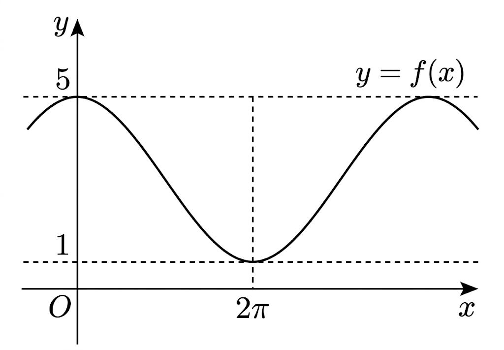

## Q
함수 $f(x)=a\cos bx+c$의 그래프는 그림과 같고,
$f(0)=5$, $f(2\pi)=1$일 때, $f\!\left(\dfrac{2\pi}{3}\right)$의 값은? (단, $a$, $b$, $c$는 상수이고 $a>0$, $b>0$이다.)

## Choices
① $1$
② $2$
③ $3$
④ $4$
⑤ $5$

## Answer
④

## Solution
그래프에서 최댓값이 $5$, 최솟값이 $1$이므로
\[
a=\frac{5-1}{2},\qquad c=\frac{5+1}{2}
\]
즉 $a=2$, $c=3$이다.

또 $x=0$에서 최댓값, $x=2\pi$에서 최솟값이므로 반주기가 $2\pi$이다.
따라서 주기는 $4\pi$, 즉
\[
\frac{2\pi}{b}=4\pi\Rightarrow b=\frac12
\]
이다.

그러므로
\[
f\!\left(\frac{2\pi}{3}\right)
=2\cos\left(\frac12\cdot\frac{2\pi}{3}\right)+3
=2\cos\frac\pi3+3
=2\cdot\frac12+3=4
\]
이므로 정답은 ④이다.
