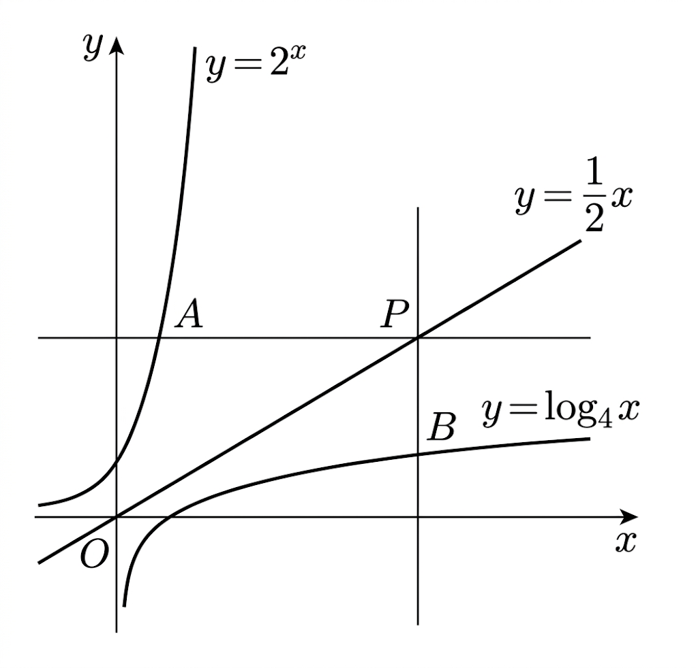

## Q
그림과 같이 직선 $y=\dfrac12x$ 위의 점 $P(a,b)$를 지나고 $x$축에 평행한 직선이 곡선 $y=2^x$와 만나는 점을 $A$, 점 $P$를 지나고 $y$축에 평행한 직선이 곡선 $y=\log_4x$와 만나는 점을 $B$라 하자. $\overline{PB}=5$일 때, $\overline{PA}$의 값은? (단, $a>1$)

## Choices
① $10$
② $11$
③ $12$
④ $13$
⑤ $14$

## Answer
②

## Solution
$P(a,b)$가 직선 $y=\dfrac12x$ 위의 점이므로
\[
b=\frac a2
\]
이다.

$B$는 $x=a$에서 $y=\log_4x$ 위의 점이므로
\[
B=(a,\log_4a)
\]
이고,
\[
\overline{PB}=b-\log_4a=5
\]
이므로
\[
\frac a2-\log_4a=5
\]
\[
a-\log_2a=10
\]
을 얻는다.

한편 $A$는 $y=b$와 $y=2^x$의 교점이므로
\[
A=(\log_2b,\ b)
\]
따라서
\[
\overline{PA}=a-\log_2b
\]
\[
=a-\log_2\left(\frac a2\right)
=a-(\log_2a-1)
=(a-\log_2a)+1
=10+1
=11
\]
이다.

정답은 ②이다.
