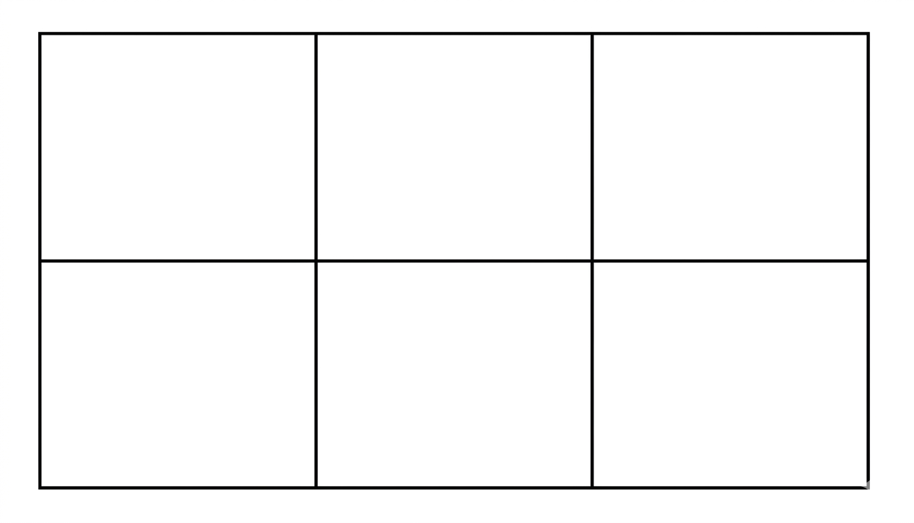

## Q
그림과 같이 크기가 같은 직사각형으로 이루어진 6개의 영역에 여섯 개의 수 $1,2,3,4,5,6$을 모두 사용하여 넣을 수 있는 경우의 수는?
(단, 한 영역에 한 개의 수만 들어가고, 회전하여 일치하는 것은 같은 것으로 본다.)

## Choices
① 120
② 240
③ 360
④ 480
⑤ 720

## Answer
③

## Solution
회전을 구별하면 배열 수는
$$
6!=720
$$
이다.

이 직사각형은 180도 회전만 자기 자신과 일치한다.
(90도 회전은 가로세로가 바뀌므로 일치하지 않음)

또한 서로 다른 수 6개를 넣으므로 180도 회전에도 같은 배열이 될 수 없다.
따라서 서로 짝을 이루어
$$
\frac{720}{2}=360
$$
가지이다.
