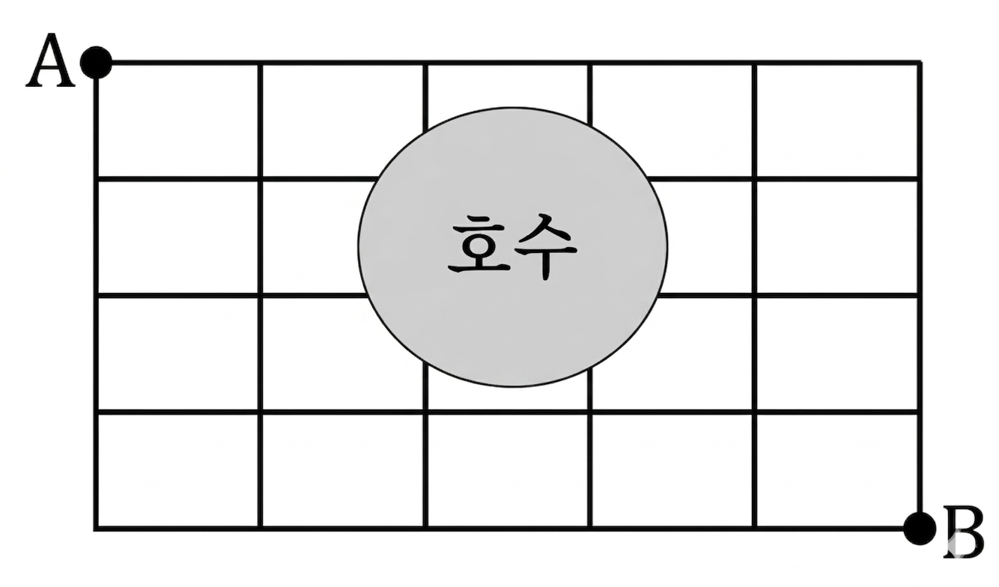

## Q
오른쪽 그림과 같은 도로망에서 호수를 지나지 않고 $A$ 지점에서 $B$ 지점까지 최단 거리로 가는 방법의 수는?

## Choices
① 18
② 20
③ 22
④ 24
⑤ 26

## Answer
⑤

## Solution
격자점에서 오른쪽으로 1칸, 아래로 1칸씩만 가는 경우를 센다.
호수에 해당하는 중앙의 4개 점은 지날 수 없으므로 그 점들의 값은 0으로 둔다.

각 점까지 가는 경우의 수를
"윗점의 값 + 왼쪽점의 값"으로 채우면,
마지막 점 $B$의 값이
$$
26
$$
이 된다.

따라서 경우의 수는 26이다.
