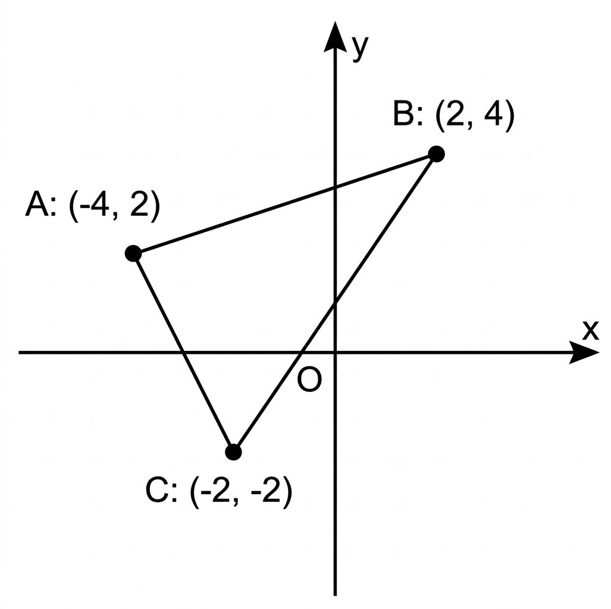

## Q
다음 그림과 같이 세 점 \(A(-4,2)\), \(B(2,4)\), \(C(-2,-2)\)를 꼭짓점으로 하는 삼각형 \(ABC\)의 넓이는?

## Choices
① 12
② 14
③ 16
④ 18
⑤ 20

## Answer
②

## Solution
점 \(A(-4,2)\), \(B(2,4)\)를 지나는 직선의 방정식을 구하면
\[
y-2=\frac{1}{3}(x+4)
\]
이므로
\[
x-3y+10=0.
\]

밑변을 \(AB\)로 잡으면, 두 점 사이의 거리 공식에 의해
\[
AB=\sqrt{(2-(-4))^2+(4-2)^2}
=\sqrt{6^2+2^2}
=2\sqrt{10}.
\]

높이는 점 \(C(-2,-2)\)에서 직선 \(AB\)까지의 거리이므로
\[
h=\frac{|(-2)-3(-2)+10|}{\sqrt{1^2+(-3)^2}}
=\frac{14}{\sqrt{10}}.
\]

따라서 삼각형 \(ABC\)의 넓이는
\[
\frac12\cdot AB\cdot h
=\frac12\cdot2\sqrt{10}\cdot\frac{14}{\sqrt{10}}
=14.
\]
따라서 정답은 \(14\)이다.

<!-- classifier_reason: rule-score:4,hits:1 -->
