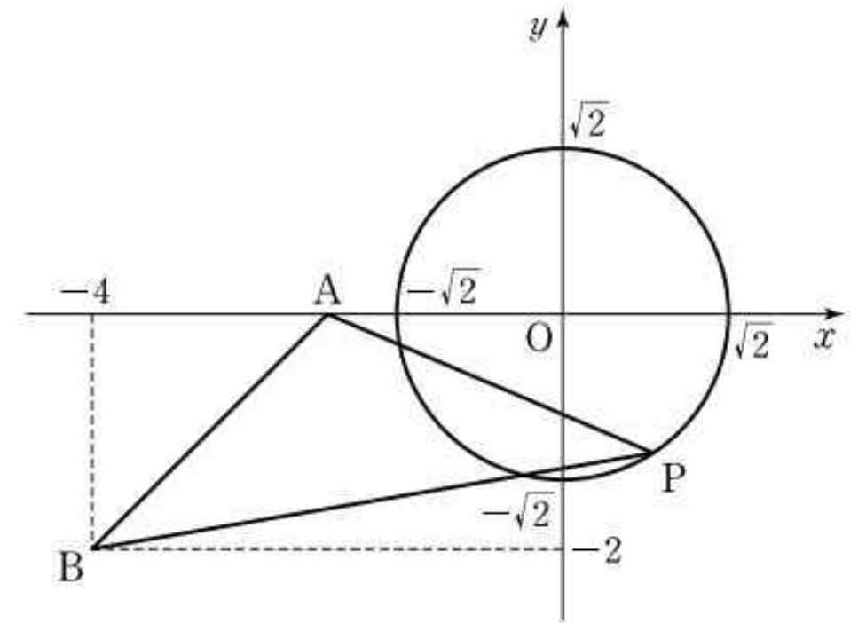

## Q
좌표평면 위의 두 점 $A(-2,0)$, $B(-4,-2)$와 원 $x^2+y^2=2$ 위의 임의의 점 $P$에 대하여 삼각형 $ABP$의 넓이의 최댓값을 $s$라 하고, 넓이가 최대가 될 때의 점 $P$의 좌표를 $(a,b)$라 할 때, $s+a+b$의 값은?

## Choices
① $-2$
② $0$
③ $2$
④ $4$
⑤ $6$

## Answer
④

## Solution
직선 $AB$의 기울기는
$$
\frac{-2-0}{-4-(-2)}=1
$$
이므로 직선 $AB$의 방정식은
$$
y=x+2
$$
이다.

따라서
$$
x-y+2=0
$$
로 쓸 수 있다.

삼각형 $ABP$의 넓이는 밑변 $AB$의 길이가 일정하므로, 점 $P$에서 직선 $AB$까지의 거리가 최대일 때 최대가 된다.

원의 중심은 $O(0,0)$이고 반지름은
$$
\sqrt{2}
$$
이다.

점 $O$에서 직선 $AB$까지의 거리는
$$
\frac{|0-0+2|}{\sqrt{1^2+(-1)^2}}
=\frac{2}{\sqrt{2}}
=\sqrt{2}
$$
이다.

따라서 원 위의 점에서 직선 $AB$까지의 거리의 최댓값은
$$
\sqrt{2}+\sqrt{2}=2\sqrt{2}
$$
이다.

또
$$
AB=\sqrt{(-4+2)^2+(-2-0)^2}=2\sqrt{2}
$$
이므로 삼각형의 넓이의 최댓값은
$$
s=\frac{1}{2}\cdot 2\sqrt{2}\cdot 2\sqrt{2}=4
$$
이다.

넓이가 최대가 될 때의 점 $P$는 원의 중심 $O$를 지나고 직선 $AB$에 수직인 직선 위에 있다.
직선 $AB$의 기울기가 $1$이므로 이 직선의 방정식은
$$
y=-x
$$
이다.

원 $x^2+y^2=2$와 직선 $y=-x$의 교점은
$$
(1,-1),\ (-1,1)
$$
이고, 직선 $AB$에서 더 멀리 있는 점은
$$
(1,-1)
$$
이다.

따라서
$$
a+b=1+(-1)=0
$$
이고,
$$
s+a+b=4+0=4
$$
이다.
