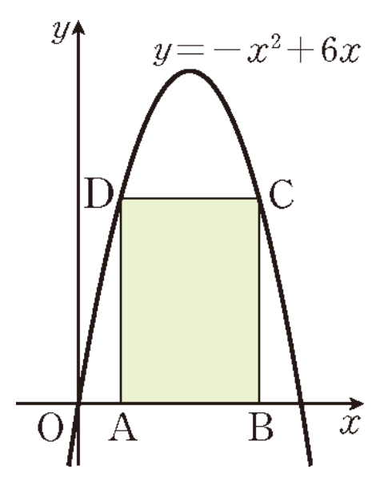

## Q
오른쪽 그림의 직사각형 $ABCD$에서 두 점 $A,B$는 $x$축 위에 있고, 두 점 $C,D$는 이차함수 $y=-x^2+6x$의 그래프 위에 있다. 이때 직사각형 $ABCD$의 둘레의 길이의 최댓값은?

## Choices
① $8$
② $12$
③ $16$
④ $20$
⑤ $24$

## Answer
④

## Solution
왼쪽 위 꼭짓점 $D$의 $x$좌표를 $t\ (0<t<3)$라 두면 오른쪽 위 꼭짓점 $C$의 $x$좌표는 $6-t$이다.

가로 길이와 세로 길이는
$$
6-2t,\quad t(6-t)
$$
이므로 둘레 $P$는
$$
P=2\{(6-2t)+t(6-t)\}=12+8t-2t^2
$$
이다.

이는 아래로 볼록인 이차식이므로 꼭짓점에서 최댓값을 갖고,
$$
t=2
$$
일 때
$$
P_{\max}=20
$$
이다.

