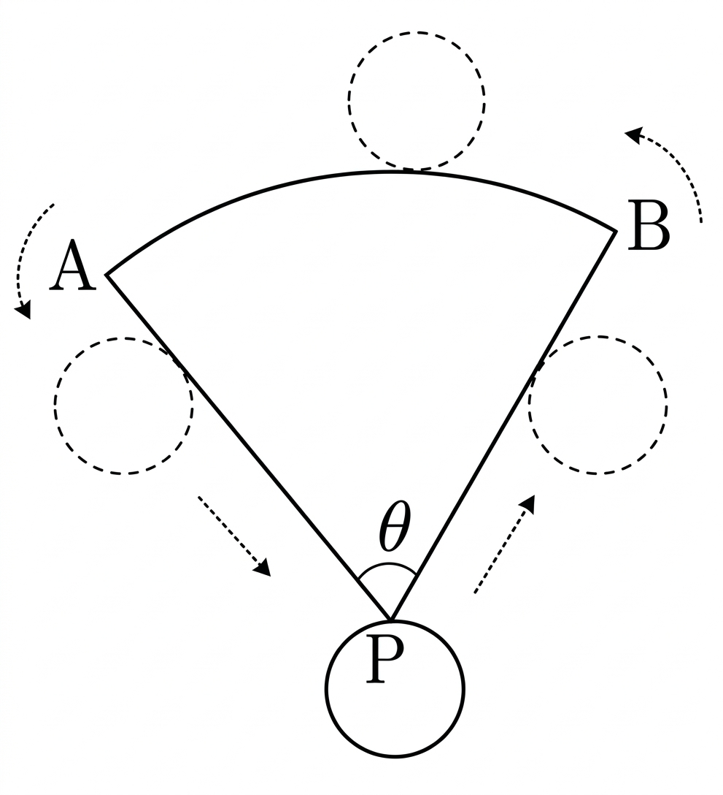

## Q
다음 그림과 같이 중심각의 크기가 $\theta$이고 반지름의 길이가 $8$인 부채꼴 $PAB$가 있다. 반지름의 길이가 $1$인 원이 부채꼴의 둘레를 따라 $4$바퀴를 회전하면 정확히 본래 위치로 돌아온다고 할 때, 부채꼴 $PAB$의 중심각 $\theta$의 크기는?

## Choices
① $\pi-3$
② $\pi-\dfrac{5}{2}$
③ $\pi-2$
④ $\pi-\dfrac{3}{2}$
⑤ $\pi-1$

## Answer
③

## Solution
반지름이 $1$인 원이 $4$바퀴 굴러간 거리는
$$
4\times 2\pi\times 1=8\pi
$$
이다.
부채꼴의 둘레의 길이는 $8+8+8\theta=16+8\theta$이므로
$$
16+8\theta=8\pi
$$
이다. 따라서
$$
\theta=\pi-2
$$
