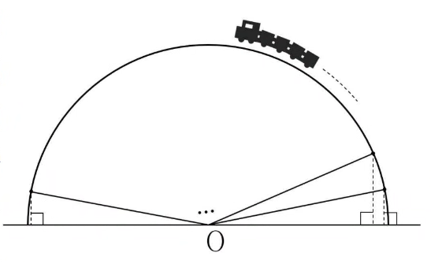

## Q
다음 그림과 같이 지면에서 출발하여 반지름의 길이가 $9$인 반원을 그리며 이동하는 모노레일을 설치하고자 한다. 모노레일 이동 경로의 $\dfrac{1}{18}$지점마다 지면과 수직인 지지대를 설치한다고 할 때, 설치하는 모든 지지대 길이의 제곱의 합은? (단, 지지대의 폭은 고려하지 않는다.)

## Choices
① 153
② 507
③ 668
④ 729
⑤ 930

## Answer
④

## Solution
반원의 중심을 원점으로 두고, 반원의 호를 $18$등분하면 $k$번째 지지대의 길이를 $h_k$라 할 때
$$
h_k=9\sin\frac{k\pi}{18}\qquad (k=1,2,\ldots,17)
$$
이다.
따라서 지지대 길이의 제곱의 합은
$$
\sum_{k=1}^{17} h_k^2=81\sum_{k=1}^{17}\sin^2\frac{k\pi}{18}=81\times 9=729
$$
이다.
