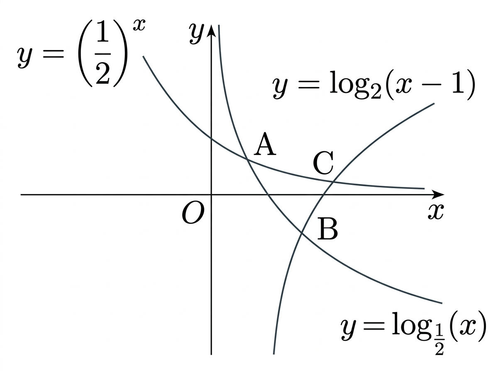

## Q
그림과 같이 두 함수 $y=\log_{\frac12}x$, $y=\left(\dfrac12\right)^x$의 그래프의 교점을 $A$라 하고, 이 두 함수의 그래프와 함수 $y=\log_2(x-1)$의 그래프의 교점을 각각 $B$, $C$라 하자. <보기>에서 옳은 것만을 있는 대로 고른 것은?

ㄱ. 원점 $O$에 대하여 $\overline{OA}>\dfrac{\sqrt{2}}{2}$이다. ㄴ. 점 $B$의 $x$좌표를 $b$라 하면 $\dfrac32<b<2$이다. ㄷ. 점 $C$와 직선 $y=x$ 사이의 거리는 $\sqrt{2}$보다 크다.

## Choices
① ㄱ
② ㄱ, ㄴ
③ ㄱ, ㄷ
④ ㄴ, ㄷ
⑤ ㄱ, ㄴ, ㄷ

## Answer
②

## Solution
점 $B$는 $\log_{\frac12}x=\log_2(x-1)$에서 정해지므로
$$
-\log_2 x=\log_2(x-1)\Rightarrow \log_2\frac{1}{x}=\log_2(x-1)\Rightarrow x^2-x-1=0
$$
이다. 따라서
$$
b=\frac{1+\sqrt5}{2}
$$
이므로 $\dfrac32<b<2$이다.

점 $A$는 $y=\log_{\frac12}x$와 $y=\left(\dfrac12\right)^x$의 교점이므로 $x=y$인 제1사분면의 점이며, 수치적으로 $A\approx(0.641,0.641)$이다. 따라서
$$
\overline{OA}\approx \sqrt{2}\times 0.641 > \frac{\sqrt2}{2}
$$
이어서 ㄱ은 참이다.

또 점 $C$는 대략 $C\approx(2.167,0.223)$이므로 직선 $y=x$와의 거리는
$$
\frac{|2.167-0.223|}{\sqrt2}<\sqrt2
$$
가 되어 ㄷ은 거짓이다. 따라서 옳은 것은 ㄱ, ㄴ이다.
