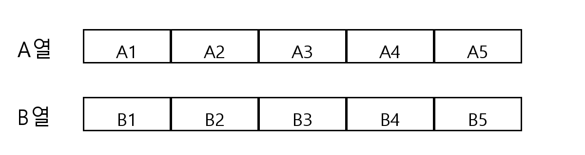

## Q
두 쌍의 부부를 포함한 남자 5명, 여자 2명이 졸업식에 참여해 아래 그림과 같은 좌석에 앉으려고 한다.
각각의 부부는 이웃해 앉고, 두 쌍의 부부는 같은 열에 앉는다.
부부에 속한 남자를 제외한 남자 3명은 서로 이웃하지 않도록 앉는 방법의 수는?

## Choices
① $1968$
② $2016$
③ $2064$
④ $2112$
⑤ $2160$

## Answer
②

## Solution
두 쌍의 부부가 같은 열에 앉으므로, 먼저 부부가 앉을 열을 정한다.

1) 부부가 앉는 열 선택: A열 또는 B열, $2$가지.

2) 한 열(좌석 5칸)에서 길이 2인 자리 블록 2개를 겹치지 않게 잡는 방법:
$([1,2],[3,4]),([1,2],[4,5]),([2,3],[4,5])$의 $3$가지.

3) 두 부부를 두 블록에 배치: $2!$가지, 각 블록에서 부부 자리 바꾸기 $2^2$가지.

따라서 부부 배치는
$$
2\times3\times2!\times2^2=48
$$
가지.

이제 남은 남자 3명을 배치한다.
부부가 앉은 열에는 빈칸 1개, 다른 열에는 빈칸 5개가 남는다.
남자 3명이 서로 이웃하지 않게 앉는 경우는

- 5칸 열에 3명 모두 배치: 비인접 자리 선택 1가지, 사람 배치 $3!$로 $6$가지
- 5칸 열에 2명, 1칸 열에 1명 배치: 5칸에서 비인접 2자리 선택 $6$가지, 사람 배치 $3\times2!=6$가지

합하여
$$
6+6\times6=42
$$
가지.

전체는
$$
48\times42=2016.
$$