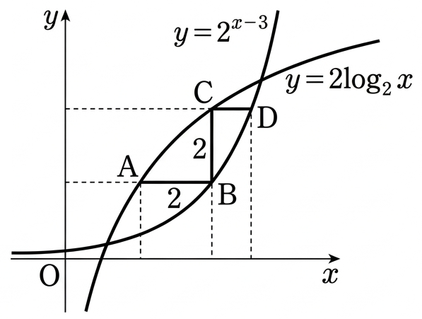

## Q
다음 그림은 두 함수 $y=2^{x-3}$, $y=2\log_2 x$의 그래프이다. $\overline{\text{AB}}=2$, $\overline{\text{BC}}=2$일 때, 사각형 ABDC의 넓이는? (단, 점선은 $x$축과 $y$축에 평행하다.)

## Choices
① 3
② $\frac{7}{2}$
③ 4
④ $\frac{9}{2}$
⑤ 5

## Answer
③

## Solution
주어진 그림에서 점 A, B, C, D의 좌표를 설정한다.
점 A의 좌표를 $(x_A, y_A)$라고 하자.
$\overline{\text{AB}}=2$이고 AB는 $x$축에 평행하므로, 점 B의 좌표는 $(x_A+2, y_A)$이다.
$\overline{\text{BC}}=2$이고 BC는 $y$축에 평행하므로, 점 C의 좌표는 $(x_A+2, y_A+2)$이다.
점 D는 점 C와 $y$좌표가 같으므로, 점 D의 좌표는 $(x_D, y_A+2)$이다.

문제의 그림에 표시된 함수 라벨과 점의 위치를 고려하여, 점 A와 C는 함수 $y=2\log_2 x$ 위에 있고, 점 B와 D는 함수 $y=2^{x-3}$ 위에 있다고 가정한다. (만약 그림의 라벨을 그대로 따른다면 해가 보기 중에 존재하지 않으므로, 문제의 의도에 따라 라벨이 서로 바뀌었다고 해석한다.)

1.  점 A가 $y=2\log_2 x$ 위에 있으므로: $y_A = 2\log_2 x_A$ (식 1)
2.  점 B가 $y=2^{x-3}$ 위에 있으므로: $y_A = 2^{(x_A+2)-3} = 2^{x_A-1}$ (식 2)
3.  점 C가 $y=2\log_2 x$ 위에 있으므로: $y_A+2 = 2\log_2 (x_A+2)$ (식 3)

식 1과 식 3을 이용하여 $x_A$를 구한다:
식 3에서 식 1을 빼면:
$(y_A+2) - y_A = 2\log_2 (x_A+2) - 2\log_2 x_A$
$2 = 2(\log_2 (x_A+2) - \log_2 x_A)$
$1 = \log_2 \left(\frac{x_A+2}{x_A}\right)$
로그의 정의에 따라:
$2^1 = \frac{x_A+2}{x_A}$
$2x_A = x_A+2$
$x_A = 2$

$x_A=2$를 식 1에 대입하여 $y_A$를 구한다:
$y_A = 2\log_2 2 = 2 \cdot 1 = 2$.
따라서 점 A의 좌표는 $(2,2)$이다.

$x_A=2, y_A=2$를 식 2에 대입하여 확인한다:
$2 = 2^{2-1} = 2^1 = 2$. 성립한다.

이제 각 점의 좌표를 구한다:
A = $(2,2)$
B = $(x_A+2, y_A) = (2+2, 2) = (4,2)$
C = $(x_A+2, y_A+2) = (4, 2+2) = (4,4)$

점 D의 $y$좌표는 $y_C$와 같으므로 $y_D=4$이다.
점 D는 $y=2^{x-3}$ 위에 있으므로:
$4 = 2^{x_D-3}$
$2^2 = 2^{x_D-3}$
$2 = x_D-3$
$x_D = 5$.
따라서 점 D의 좌표는 $(5,4)$이다.

사각형 ABDC는 윗변 AB와 아랫변 CD가 $x$축에 평행한 사다리꼴이다.
$\overline{\text{AB}}$의 길이: $x_B - x_A = 4-2 = 2$.
$\overline{\text{CD}}$의 길이: $x_D - x_C = 5-4 = 1$.
사다리꼴의 높이: $y_C - y_A = 4-2 = 2$.

사각형 ABDC의 넓이 = $\frac{1}{2} (\overline{\text{AB}} + \overline{\text{CD}}) \times \text{높이}$
넓이 = $\frac{1}{2} (2 + 1) \times 2 = \frac{1}{2} \times 3 \times 2 = 3$.

따라서 사각형 ABDC의 넓이는 3이다.
