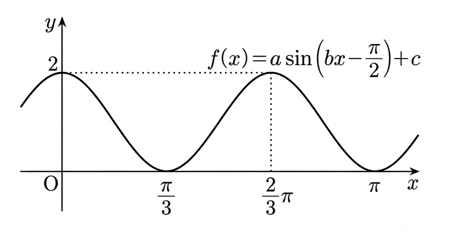

## Q
함수 $f(x)=a \sin \left(b x-\frac{\pi}{2}\right)+c$의 그래프가 다음 그림과 같을 때, $abc$의 값은? (단, $b>0$)

## Choices
① $-6$
② $-3$
③ $1$
④ $3$
⑤ $6$

## Answer
③

## Solution
주어진 함수는 $f(x)=a \sin \left(b x-\frac{\pi}{2}\right)+c$ 이다.

1.  **$c$ 값 구하기 (수직 이동)**:
    그래프의 최댓값은 $2$이고 최솟값은 $0$이다. 함수의 중간값(midline)은 $c = \frac{\text{최댓값} + \text{최솟값}}{2}$ 이다.
    $c = \frac{2+0}{2} = 1$.

2.  **$a$ 값 구하기 (진폭)**:
    함수의 진폭은 $|a| = \frac{\text{최댓값} - \text{최솟값}}{2}$ 이다.
    $|a| = \frac{2-0}{2} = 1$. 일반적으로 진폭 $a$는 양수로 간주하므로 $a=1$이다.
    (만약 $a$가 음수라면 그래프의 개형이 반전되지만, 일단 $a=1$로 가정하고 진행한다.)

3.  **$b$ 값 구하기 (주기)**:
    그래프에서 최솟값은 $x=\frac{\pi}{3}$에서 나타나고, 최댓값은 $x=\frac{2\pi}{3}$에서 나타난다. 최솟값에서 다음 최댓값까지의 거리는 주기의 절반이다.
    따라서 $\frac{T}{2} = \frac{2\pi}{3} - \frac{\pi}{3} = \frac{\pi}{3}$ 이다.
    주기 $T = \frac{2\pi}{3}$ 이다.
    함수 $f(x)=a \sin(bx-\frac{\pi}{2})+c$의 주기는 $T = \frac{2\pi}{|b|}$ 이다. 문제에서 $b>0$이므로 $T = \frac{2\pi}{b}$ 이다.
    $\frac{2\pi}{b} = \frac{2\pi}{3} \Rightarrow b=3$.

4.  **$a, b, c$ 값 확인 및 $abc$ 계산**:
    위에서 구한 값은 $a=1, b=3, c=1$ 이다.
    이 값들을 함수에 대입하면 $f(x) = 1 \cdot \sin(3x - \frac{\pi}{2}) + 1$ 이다.
    삼각함수 항등식 $\sin(\theta - \frac{\pi}{2}) = -\cos(\theta)$ 를 이용하면 $f(x) = -\cos(3x) + 1$ 이 된다.
    그래프의 점들을 확인해보자:
    *   $x=0$ 일 때, $f(0) = -\cos(0) + 1 = -1+1=0$. (그래프와 일치)
    *   $x=\frac{\pi}{3}$ 일 때, $f(\frac{\pi}{3}) = -\cos(3 \cdot \frac{\pi}{3}) + 1 = -\cos(\pi) + 1 = -(-1)+1 = 2$. (그래프에서는 최솟값 $0$이므로 불일치)
    *   $x=\frac{2\pi}{3}$ 일 때, $f(\frac{2\pi}{3}) = -\cos(3 \cdot \frac{2\pi}{3}) + 1 = -\cos(2\pi) + 1 = -1+1 = 0$. (그래프에서는 최댓값 $2$이므로 불일치)

    주어진 함수식과 그래프의 위상(phase)이 일치하지 않는 문제가 있으나, 일반적으로 이러한 문제에서는 진폭, 주기, 수직 이동을 통해 $a, b, c$ 값을 도출하는 것이 의도이다. $a$의 부호는 그래프의 시작점과 방향에 따라 결정되지만, $f(0)=0$을 만족하는 $a$는 $a=1$이다. 만약 $a=-1$이라면 $f(0)=2$가 되어 그래프와 불일치한다. 따라서 $a=1$로 가정하는 것이 합리적이다.

    따라서 $a=1, b=3, c=1$로 간주하고 $abc$의 값을 계산한다.
    $abc = 1 \cdot 3 \cdot 1 = 3$.

최종적으로 $abc = 3$ 이다.
