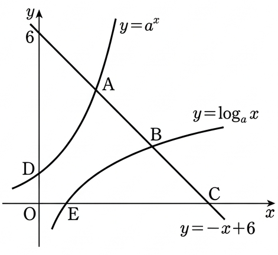

## Q
그림과 같이 직선 $y=-x+6$이 두 함수 $y=a^x$, $y=\log_a x$의 그래프와 만나는 점을 각각 A, B라 하고 $x$축과 만나는 점을 C라 하자. 함수 $y=a^x$의 그래프와 $y$축의 교점을 D, 함수 $y=\log_a x$의 그래프와 $x$축의 교점을 E라 하자. $\overline{AB}=\overline{BC}$일 때, 사각형 ADEB의 넓이는? (단, $a>1$)

## Choices
① $\frac{11}{2}$
② $\frac{13}{2}$
③ $\frac{15}{2}$
④ $\frac{17}{2}$
⑤ $\frac{19}{2}$

## Answer
$\frac{15}{2}$

## Solution
1.  **주요 점의 좌표를 파악합니다.**
    *   직선 $y=-x+6$의 $x$절편은 $y=0$일 때이므로, $-x+6=0 \Rightarrow x=6$입니다. 따라서 C의 좌표는 $(6, 0)$입니다.
    *   함수 $y=a^x$의 $y$절편은 $x=0$일 때이므로, $y=a^0=1$입니다. 따라서 D의 좌표는 $(0, 1)$입니다.
    *   함수 $y=\log_a x$의 $x$절편은 $y=0$일 때이므로, $\log_a x=0 \Rightarrow x=a^0=1$입니다. 따라서 E의 좌표는 $(1, 0)$입니다.

2.  **함수의 대칭성과 직선의 관계를 이용합니다.**
    *   함수 $y=a^x$와 $y=\log_a x$는 서로 역함수 관계이므로, 직선 $y=x$에 대해 대칭입니다.
    *   직선 $y=-x+6$은 기울기가 $-1$이므로, 직선 $y=x$와 수직입니다.
    *   따라서, 점 A가 $(x_A, y_A)$라면, $y=x$에 대해 대칭인 점 $(y_A, x_A)$는 직선 $y=-x+6$ 위에 있으면서 $y=\log_a x$ 위에 있어야 합니다. 즉, 점 B의 좌표는 $(y_A, x_A)$가 됩니다.

3.  **조건 $\overline{AB}=\overline{BC}$를 적용하여 A, B의 좌표를 구합니다.**
    *   A, B, C는 한 직선 위에 있고 $\overline{AB}=\overline{BC}$이므로, 점 B는 선분 AC의 중점입니다.
    *   중점 공식을 사용하면:
        $x_B = \frac{x_A + x_C}{2} = \frac{x_A + 6}{2}$
        $y_B = \frac{y_A + y_C}{2} = \frac{y_A + 0}{2} = \frac{y_A}{2}$
    *   위에서 구한 B의 좌표 $(y_A, x_A)$를 대입하면:
        $y_A = \frac{x_A + 6}{2} \quad \Rightarrow \quad 2y_A = x_A + 6 \quad \cdots (1)$
        $x_A = \frac{y_A}{2} \quad \Rightarrow \quad y_A = 2x_A \quad \cdots (2)$
    *   (2)를 (1)에 대입합니다:
        $2(2x_A) = x_A + 6$
        $4x_A = x_A + 6$
        $3x_A = 6 \Rightarrow x_A = 2$
    *   $x_A=2$를 (2)에 대입하면 $y_A = 2(2) = 4$입니다.
    *   따라서 A의 좌표는 $(2, 4)$이고, B의 좌표는 $(4, 2)$입니다.

4.  **$a$의 값을 구합니다.**
    *   점 A$(2, 4)$는 $y=a^x$ 위에 있으므로, $4 = a^2$입니다. 문제에서 $a>1$이므로 $a=2$입니다.
    *   (확인: 점 B$(4, 2)$는 $y=\log_a x$ 위에 있으므로, $2 = \log_2 4$입니다. 이는 $2^2=4$이므로 성립합니다.)

5.  **사각형 ADEB의 넓이를 계산합니다.**
    *   사각형 ADEB의 꼭짓점은 A$(2, 4)$, D$(0, 1)$, E$(1, 0)$, B$(4, 2)$입니다.
    *   사선 공식을 사용하여 넓이를 계산합니다:
        넓이 $= \frac{1}{2} | (x_A y_D + x_D y_E + x_E y_B + x_B y_A) - (y_A x_D + y_D x_E + y_E x_B + y_B x_A) |$
        $= \frac{1}{2} | (2 \cdot 1 + 0 \cdot 0 + 1 \cdot 2 + 4 \cdot 4) - (4 \cdot 0 + 1 \cdot 1 + 0 \cdot 4 + 2 \cdot 2) |$
        $= \frac{1}{2} | (2 + 0 + 2 + 16) - (0 + 1 + 0 + 4) |$
        $= \frac{1}{2} | 20 - 5 |$
        $= \frac{1}{2} | 15 | = \frac{15}{2}$

따라서 사각형 ADEB의 넓이는 $\frac{15}{2}$입니다.
