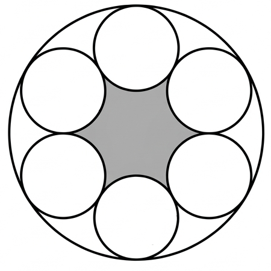

## Q
다음 그림과 같이 반지름의 길이가 9인 원에 서로 외접하는 크기가 같은 6개의 원이 내접하고 있다. 어두운 부분의 넓이가 $S=p\sqrt{3}-q\pi$ ($p, q$는 정수)일 때, $\frac{p}{q}$의 값은?

## Choices
① 3
② 5
③ 7
④ 11
⑤ 13

## Answer
6

## Solution
큰 원의 반지름을 $R$, 작은 원의 반지름을 $r$이라고 하자.
문제에서 $R=9$이다.

6개의 작은 원의 중심을 연결하면 정육각형이 된다. 큰 원의 중심을 $O$, 인접한 두 작은 원의 중심을 각각 $C_1, C_2$라고 하면, 삼각형 $OC_1C_2$는 이등변삼각형이다. 이때 $\angle C_1OC_2 = \frac{360^\circ}{6} = 60^\circ$이므로, 삼각형 $OC_1C_2$는 정삼각형이다.

작은 원은 큰 원에 내접하고 있으므로, 큰 원의 중심 $O$에서 작은 원의 중심 $C_1$까지의 거리는 $R-r$이다.
작은 원들은 서로 외접하고 있으므로, 인접한 두 작은 원의 중심 $C_1, C_2$ 사이의 거리는 $2r$이다.

정삼각형의 성질에 의해 $OC_1 = C_1C_2$이므로, 다음 관계가 성립한다.
$R-r = 2r$
$R = 3r$

$R=9$이므로 $9 = 3r$, 따라서 $r=3$이다.

어두운 부분의 넓이 $S$는 작은 원들의 중심을 연결하여 만들어지는 정육각형의 넓이에서, 각 작은 원의 중심각이 $60^\circ$인 6개의 부채꼴 넓이를 뺀 것과 같다.

1.  **정육각형의 넓이 계산:**
    정육각형의 한 변의 길이는 $2r = 2(3) = 6$이다.
    정육각형은 한 변의 길이가 $a$인 정삼각형 6개로 이루어져 있으므로, 넓이는 $6 \times \frac{\sqrt{3}}{4}a^2$이다.
    정육각형의 넓이 $= 6 \times \frac{\sqrt{3}}{4}(6)^2 = 6 \times \frac{\sqrt{3}}{4} \times 36 = 6 \times 9\sqrt{3} = 54\sqrt{3}$.

2.  **6개 부채꼴의 넓이 계산:**
    각 부채꼴은 반지름이 $r=3$이고 중심각이 $60^\circ$이다.
    하나의 부채꼴 넓이 $= \frac{60}{360}\pi r^2 = \frac{1}{6}\pi (3)^2 = \frac{1}{6} \times 9\pi = \frac{3}{2}\pi$.
    6개 부채꼴의 넓이 $= 6 \times \frac{3}{2}\pi = 9\pi$.

3.  **어두운 부분의 넓이 $S$ 계산:**
    $S = (정육각형의 넓이) - (6개 부채꼴의 넓이) = 54\sqrt{3} - 9\pi$.

주어진 식 $S=p\sqrt{3}-q\pi$와 비교하면 $p=54$, $q=9$이다.

따라서 $\frac{p}{q}$의 값은 $\frac{54}{9} = 6$이다.

(참고: 계산된 답 6은 주어진 선지 3, 5, 7, 11, 13 중에 없습니다. 문제 또는 선지에 오류가 있을 수 있습니다.)
