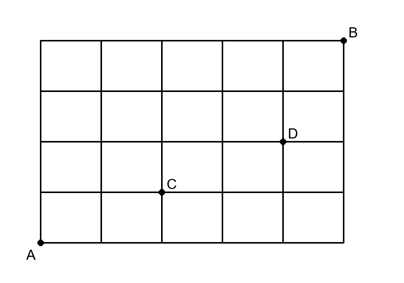

## Q
다음 그림과 같은 도로망에서 $A$지점에서 $B$지점까지 최단거리로 갈 때,
$C$지점은 지나지 않고 $D$지점은 지나는 경우의 수는?

## Choices
① 18
② 24
③ 33
④ 45
⑤ 54

## Answer
①

## Solution
그림을 좌표로 보면 $A=(0,0)$, $B=(5,4)$, $C=(2,1)$, $D=(4,2)$이다.

$D$를 지나는 최단경로 수는
$$
(A\to D)\times(D\to B)
=\frac{6!}{4!2!}\times\frac{3!}{1!2!}
=15\times 3=45
$$
이다.

이 중 $C$도 지나는 경우는
$$
(A\to C)\times(C\to D)\times(D\to B)
=\frac{3!}{2!1!}\times\frac{3!}{2!1!}\times\frac{3!}{1!2!}
=27
$$
이다.

따라서 조건을 만족하는 경우의 수는
$$
45-27=18
$$
이다.
