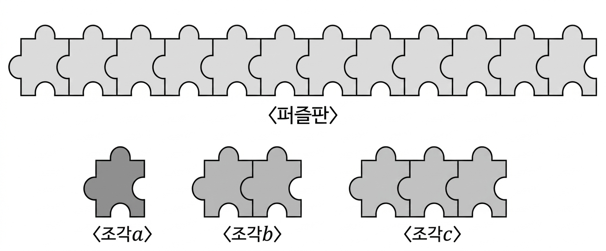

## Q
다음 그림과 같은 퍼즐판을 주어진 세 가지 모양의 조각 $a,b,c$를 사용하여 완성하는 경우의 수를 구하고,
그 풀이과정을 서술하시오.
(단, 조각 $c$는 두 조각 이상 사용한다.)

## Choices

## Answer
274

## Solution
조각 $a,b,c$의 길이를 각각 1, 2, 3칸으로 보면 퍼즐판 12칸을 채우는 문제이다.
조각의 개수를 각각 $a,b,c$개라 두면
$$
a+2b+3c=12,\quad c\ge 2
$$
이다.

각 $(a,b,c)$에 대한 배열 경우의 수는
$$
\frac{(a+b+c)!}{a!\,b!\,c!}
$$
이다.

1. $c=2$이면 $a+2b=6$.
가능한 $(a,b)$는 $(6,0),(4,1),(2,2),(0,3)$.
배열 수의 합은
$$
\frac{8!}{6!2!}
+\frac{7!}{4!1!2!}
+\frac{6!}{2!2!2!}
+\frac{5!}{3!2!}
=233
$$
이다.

2. $c=3$이면 $a+2b=3$.
가능한 $(a,b)$는 $(3,0),(1,1)$.
배열 수의 합은
$$
\frac{6!}{3!3!}+\frac{5!}{1!1!3!}=40
$$
이다.

3. $c=4$이면 $a+2b=0$이므로 $(a,b)=(0,0)$이고 배열 수는 1이다.

따라서 전체 경우의 수는
$$
233+40+1=274
$$
이다.
