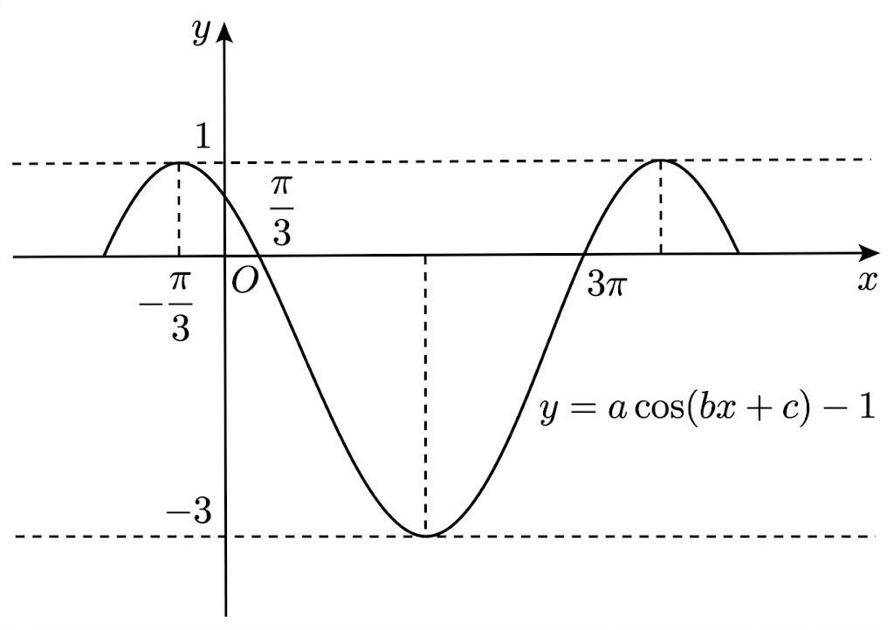

## Q
다음 그림은
\[
y=a\cos(bx+c)-1
\]
의 그래프이다. 주기를 $p\pi$라 할 때,
\[
\frac{p}{abc}
\]
의 값을 구하여라. (단, $a>0$, $b>0$, $0<c<\pi$)

## Choices

## Answer
$\dfrac{24}{\pi}$

## Solution
그래프의 최댓값이 $1$, 최솟값이 $-3$이므로
\[
a=2
\]
이다.

그래프에서
\[
x=\frac{\pi}{3}\ \text{에서 }y=0,\qquad x=3\pi\ \text{에서 }y=0
\]
이며 두 점에서 기울기 부호가 반대이므로
\[
b\left(3\pi-\frac{\pi}{3}\right)=\frac{4\pi}{3}
\Rightarrow b=\frac12
\]
이다.

또 $x=-\dfrac{\pi}{3}$에서 꼭댓점을 가지므로
\[
b\left(-\frac{\pi}{3}\right)+c=0
\Rightarrow c=\frac{\pi}{6}
\]
이다.

주기 $T$는
\[
T=\frac{2\pi}{b}=4\pi
\]
이므로 $p=4$.

따라서
\[
\frac{p}{abc}
=\frac{4}{2\cdot\frac12\cdot\frac{\pi}{6}}
=\frac{24}{\pi}
\]
이다.
