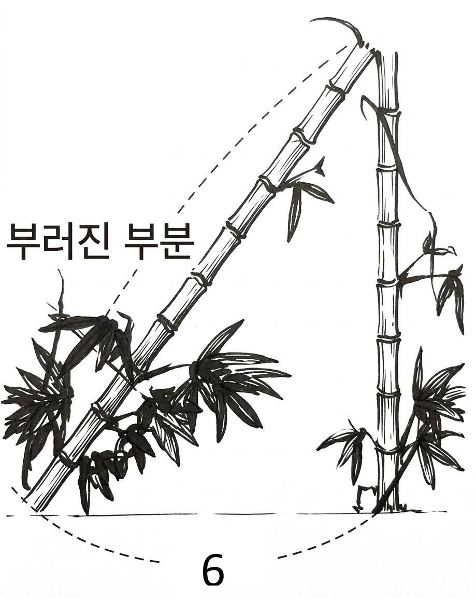

## Q
오른쪽 그림과 같이 높이가 \(12\)규빗인 대나무가 바람에 부러져서 그 끝이 처음 대나무가 나온 부분으로부터 \(6\)규빗 떨어진 곳에 닿았다. 이때 대나무의 부러진 부분의 길이를 구하면?

## Choices
① \(\dfrac{7}{2}\)
② \(\dfrac{9}{2}\)
③ \(\dfrac{11}{2}\)
④ \(\dfrac{13}{2}\)
⑤ \(\dfrac{15}{2}\)

## Answer
⑤

## Solution
남은 대나무 길이를 \(h\), 부러진 부분 길이를 \(L\)이라 하면
\[
h+L=12,\qquad L^2=h^2+6^2.
\]
\(L=12-h\)를 대입하면
\[
(12-h)^2=h^2+36 \Rightarrow 144-24h=36 \Rightarrow h=\dfrac{9}{2}.
\]
따라서 \(L=12-\dfrac{9}{2}=\dfrac{15}{2}\)이다.

<!-- classifier_reason: rule-score:4,hits:1 -->
