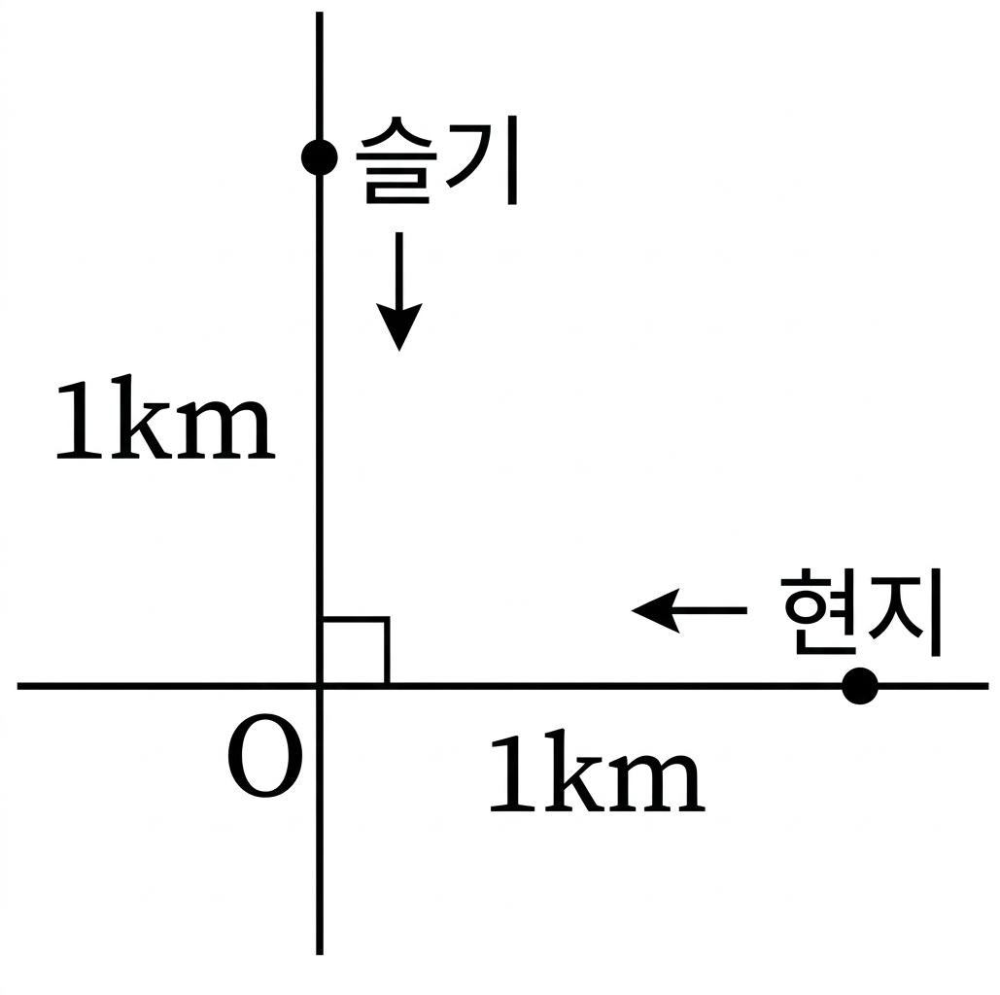

## Q
오른쪽 그림과 같이 지점 \(O\)에서 수직으로 만나는 직선 도로가 있다. 서로 다른 도로에 있는 슬기와 현지가 지점 \(O\)에서 각각 \(1\text{ km}\) 떨어진 곳에서 1분에 \(30\text{ m}\), \(40\text{ m}\)의 일정한 속력으로 지점 \(O\)를 향하여 직진하였다. 두 사람이 동시에 출발할 때, 두 사람 사이의 거리가 가장 가까워지는 것은 출발한 지 몇 분 후인지 구하면?

## Choices
① 7분 후
② 14분 후
③ 28분 후
④ 42분 후
⑤ 84분 후

## Answer
③

## Solution
출발 후 \(t\)분일 때 슬기, 현지의 좌표를 각각
\((0,1000-30t),\ (1000-40t,0)\)으로 둘 수 있다.
거리의 제곱은
\[
D^2=(1000-40t)^2+(1000-30t)^2=2500t^2-140000t+2000000.
\]
이차식의 최솟값은 꼭짓점에서 이루어지므로
\(t=\dfrac{140000}{2\cdot2500}=28\).
따라서 28분 후이다.

<!-- classifier_reason: rule-score:5,hits:1 -->
