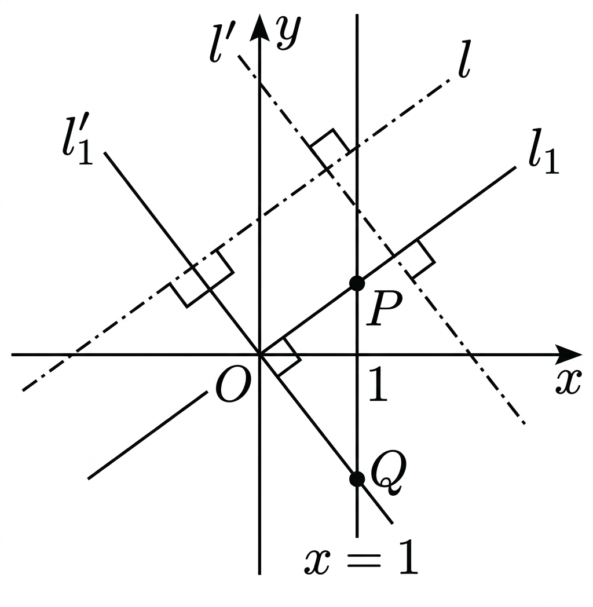

## Q
다음은 좌표평면에서 두 직선이 서로 수직일 조건을 증명하는 과정이다. 괄호 안의 내용이 올바르게 대응된 것을 고르면?

두 직선 \(l:y=mx+n,\ l':y=m'x+n'\)이 서로 수직이면,두 직선 \(l, l'\)과 각각 평행하고 원점을 지나는 두 직선\(l_1:y=mx,\ l_1':y=m'x\)도 서로 수직이다. 즉 두 직선 \(l,l'\)이 서로 수직일 조건은 두 직선 \(l_1,l_1'\)이 서로 수직일 조건과 같다. 두 직선 \(l_1,l_1'\)과 직선 \(x=1\)의 교점을 각각 \(P,Q\)라 하면\(P(가),\ Q(나)\)이고,\(\overline{OP}^2+\overline{OQ}^2=\overline{PQ}^2\),즉 \((다)^2+(1+m'^2)=(라)^2\)이다. 이 식을 정리하면 \(mm'=(마)\)이다.

## Choices

① (가) \((1,m)\), (나) \((1,m')\), (다) \(1-m^2\), (라) \((m+m')^2\), (마) \(1\)
② (가) \((m,1)\), (나) \((1,m')\), (다) \(m^2-1\), (라) \((m-m')^2\), (마) \(1\)
③ (가) \((2,m)\), (나) \((m',1)\), (다) \(2+m\), (라) \((m+m')^2\), (마) \(1\)
④ (가) \((1,m)\), (나) \((1,m')\), (다) \(1+m^2\), (라) \((m-m')^2\), (마) \(-1\)
⑤ (가) \((m,1)\), (나) \((m',1)\), (다) \(2+m^2\), (라) \((m+m')^2\), (마) \(-1\)

## Answer
④

## Solution
\(x=1\)에서 \(l_1,y=mx\)의 점은 \(P(1,m)\), \(l_1',y=m'x\)의 점은 \(Q(1,m')\)이므로
(가), (나)는 각각 \((1,m),\ (1,m')\)이다.
또 \(\overline{OP}^2=1+m^2\), \(\overline{OQ}^2=1+m'^2\), \(\overline{PQ}^2=(m-m')^2\).
따라서 (다)=\(1+m^2\), (라)=\((m-m')^2\)이고
\((1+m^2)+(1+m'^2)=(m-m')^2\Rightarrow mm'=-1\).
즉 (마)=\(-1\)이다.

<!-- classifier_reason: rule-score:6,hits:2 -->
