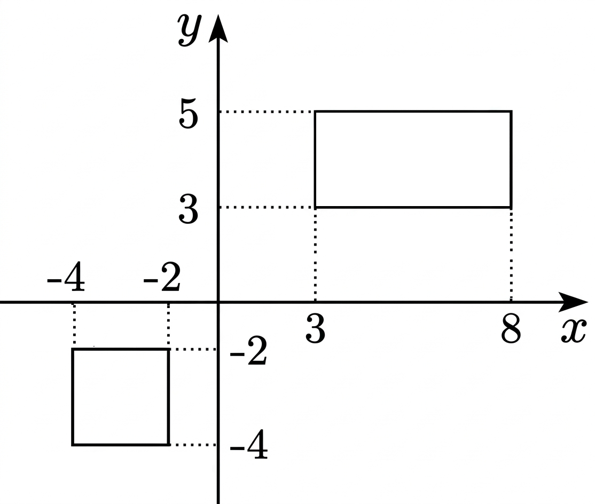

## Q
오른쪽 그림과 같이 좌표평면 위에 있는 두 직사각형의 넓이를 동시에 이등분하는 직선의 방정식을 구하면?

## Choices

① \(5x-6y+2=0\)
② \(3x-y+4=0\)
③ \(14x+17y+9=0\)
④ \(5x-6y-2=0\)
⑤ \(14x-17y-9=0\)

## Answer
⑤

## Solution
직사각형의 넓이를 이등분하는 직선은 각 직사각형의 중심을 지난다.
오른쪽 직사각형 중심은 \(\left(\dfrac{3+8}{2},\dfrac{3+5}{2}\right)=\left(\dfrac{11}{2},4\right)\),
왼쪽 직사각형 중심은 \(\left(\dfrac{-4+(-2)}{2},\dfrac{-4+(-2)}{2}\right)=(-3,-3)\).
두 점을 지나는 직선의 기울기는
\[
m=\frac{4-(-3)}{\frac{11}{2}-(-3)}=\frac{7}{17/2}=\frac{14}{17}.
\]
점 \((-3,-3)\)을 대입하면
\(y+3=\dfrac{14}{17}(x+3)\Rightarrow 14x-17y-9=0\).

<!-- classifier_reason: rule-score:11,hits:3 -->
