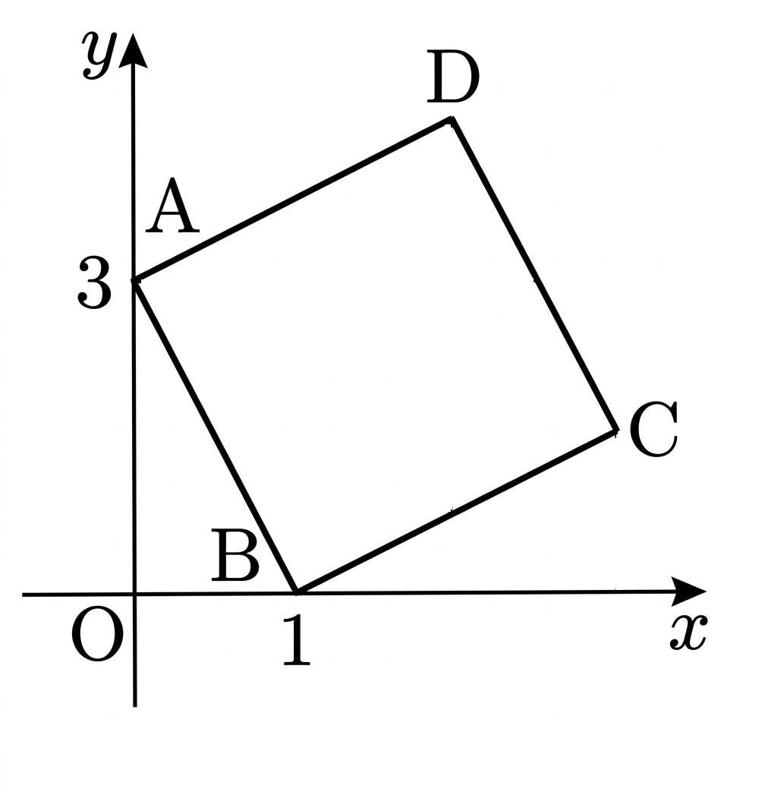

## Q
오른쪽 그림과 같이 두 점 \(A(0,3)\), \(B(1,0)\)을 꼭짓점으로 하는 정사각형 \(ABCD\)에 대하여 직선 \(CD\)의 방정식을 구하시오. (단, 두 점 \(C,D\)는 제1사분면 위의 점이다.)

## Choices

## Answer
\(y=-3x+13\)

## Solution
\(\overrightarrow{AB}=(1,-3)\)이므로 이에 수직이고 길이가 같은 벡터를 \((3,1)\)로 잡으면
\(C=B+(3,1)=(4,1),\ D=A+(3,1)=(3,4)\)가 되어 둘 다 제1사분면 위에 있다.
따라서 \(CD\)의 기울기는
\(\dfrac{1-4}{4-3}=-3\),
점 \((4,1)\)을 지나므로
\(y-1=-3(x-4)\Rightarrow y=-3x+13\).

<!-- classifier_reason: rule-score:8,hits:2 -->
