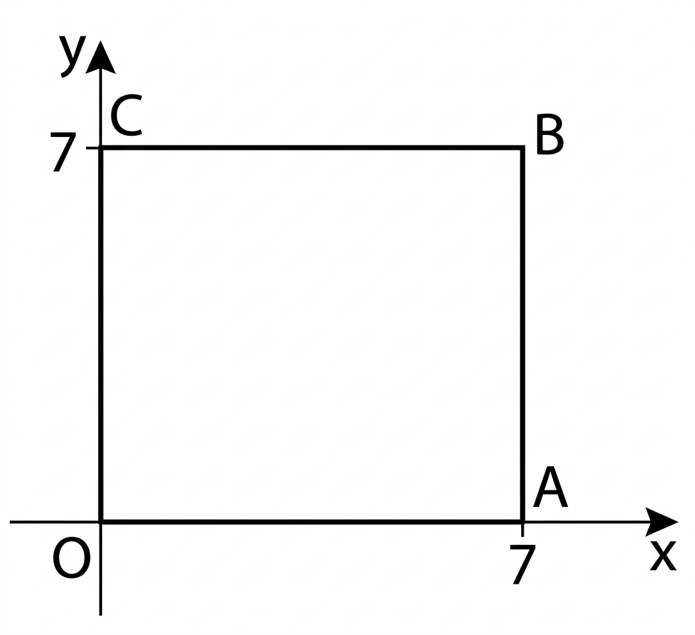

## Q
직선 \(l:kx-y-3k+2=0\)이 있다. \(0<k\le\dfrac54\)일 때, 사각형 \(OABC\)의 내부에서 직선 \(l\)이 그려지는 범위의 넓이를 구하시오.

## Choices

## Answer
\(\dfrac{72}{5}\)

## Solution
직선을 \(y=k(x-3)+2\)로 쓰면 모든 직선은 점 \((3,2)\)를 지난다.
그림에서 \(OABC\)는 \(0\le x\le7,\ 0\le y\le7\)인 정사각형이다.
\(k=\dfrac54\)일 때 경계선은 \(y=\dfrac54(x-3)+2\).
따라서 직선이 지나가는 범위는
\(x<3\)에서는 \(\max\{0,\dfrac54(x-3)+2\}\le y\le2\),
\(x>3\)에서는 \(2\le y\le\dfrac54(x-3)+2\)이다.
이 영역을 세 부분으로 나누면
\(x=0\)부터 \(x=\dfrac75\)까지의 직사각형(가로 \(\dfrac75\), 세로 \(2\)),
\(x=\dfrac75\)부터 \(x=3\)까지의 삼각형(밑변 \(\dfrac85\), 높이 \(2\)),
\(x=3\)부터 \(x=7\)까지의 삼각형(밑변 \(4\), 높이 \(5\))이다.
따라서 면적은
\[
\frac75\cdot2+\frac12\cdot\frac85\cdot2+\frac12\cdot4\cdot5
=\frac{14}{5}+\frac{8}{5}+10
=\frac{72}{5}.
\]

<!-- classifier_reason: rule-score:5,hits:1 -->
