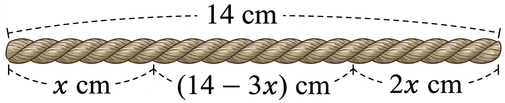

## Q
그림과 같이 길이가 \(14\text{ cm}\)인 끈의 양 끝을 각각 \(x\text{ cm},\ 2x\text{ cm}\)만큼 자른 후 세 조각의 끈을 세 변으로 하는 삼각형을 만들려고 한다. 세 조각의 끈을 세 변으로 하는 삼각형을 만들 수 있는 \(x\)의 값의 범위를 구하는 과정을 서술하시오.
(단, 끈의 굵기는 무시한다.)

## Choices

## Answer
\(\dfrac73<x<\dfrac72\)

## Solution
세 변의 길이는 \(x,\ 2x,\ 14-3x\)이다.
삼각형이 되려면
\[
\begin{cases}x+2x>14-3x\\x+(14-3x)>2x\\2x+(14-3x)>x\end{cases}
\]
즉
\(6x>14\Rightarrow x>\dfrac73\),
\(14>4x\Rightarrow x<\dfrac72\),
\(14>2x\Rightarrow x<7\) (앞의 조건보다 약함).
따라서 범위는 \(\dfrac73<x<\dfrac72\)이다.

<!-- classifier_reason: rule-score:4,hits:1 -->
