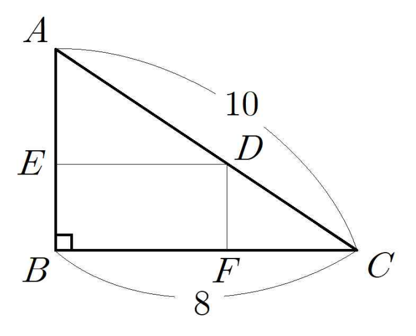

## Q
오른쪽 그림과 같이 \(\overline{AC}=10\), \(\overline{BC}=8\)인 직각삼각형 \(ABC\)의 빗변 \(\overline{AC}\) 위의 점 \(D\)에서 두 변 \(\overline{AB}\), \(\overline{BC}\)에 내린 수선의 발을 각각 \(E\), \(F\)라고 하자. 이때 직사각형 \(DEBF\)의 넓이의 최댓값을 구하면?

## Choices
① \(6\)
② \(8\)
③ \(10\)
④ \(12\)
⑤ \(14\)
## Answer
④

## Solution
직각삼각형에서 \(AB=\sqrt{10^2-8^2}=6\)이다.
점 \(B\)를 원점으로 두고 \(C=(8,0)\), \(A=(0,6)\)이라 하자. 그러면 빗변 \(AC\)의 방정식은
\[
y=-\frac{3}{4}x+6
\]
이다.
점 \(D=(x,y)\)라 하면 직사각형 \(DEBF\)의 넓이 \(S\)는
\[
S=xy=x\left(-\frac{3}{4}x+6\right)=-\frac{3}{4}x^2+6x
\]
이다.
이 식의 최댓값은 꼭짓점에서 나오므로
\[
x=\frac{-6}{2\cdot(-3/4)}=4
\]
일 때 최대이고,
\[
S=-\frac{3}{4}\cdot 16+24=12
\]
이다.
