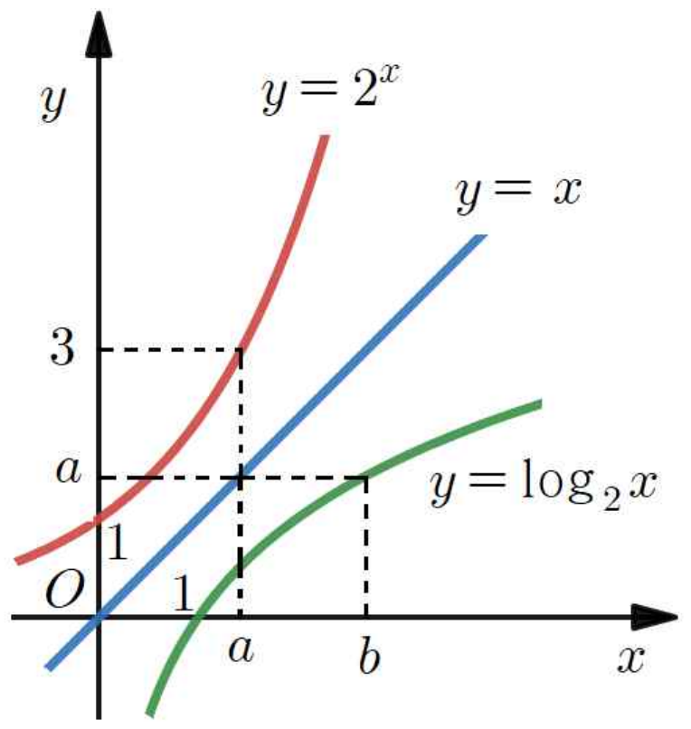

## Q
오른쪽 그림은 함수 $y=2^x$, $y=\log_2 x$의 그래프와 직선 $y=x$이다. $b^{\frac{1}{a}}$의 값은?

## Choices
① $1$
② $\dfrac{3}{2}$
③ $2$
④ $\dfrac{5}{2}$
⑤ $3$

## Answer
③

## Solution
그림에서 점 $(a,3)$가 함수 $y=2^x$ 위에 있으므로
\[
2^a=3
\]
이다.

또 점 $(b,a)$가 함수 $y=\log_2 x$ 위에 있으므로
\[
a=\log_2 b
\]
이고, 따라서
\[
b=2^a=3
\]
이다.

그러므로
\[
b^{1/a}=3^{1/\log_2 3}=3^{\log_3 2}=2
\]
이다.
