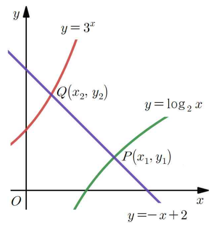

## Q
두 함수 $y=\log_2 x$, $y=3^x$의 그래프와 $y=-x+2$가 만나는 점을 각각 $P(x_1,y_1)$, $Q(x_2,y_2)$라 할 때, 옳은 것만을 보기에서 있는 대로 고른 것은?

&lt;보기&gt; 
ㄱ. $x_2y_1<x_1y_2$ 
ㄴ. $x_1^2+y_1^2<x_2^2+y_2^2$ 
ㄷ. $x_1x_2<y_1y_2$

## Choices
① ㄱ
② ㄴ
③ ㄱ, ㄴ
④ ㄴ, ㄷ
⑤ ㄱ, ㄴ, ㄷ

## Answer
⑤

## Solution
그래프에서 $P$에 대하여 $1<x_1<\dfrac32$, $0<y_1<1$이고, $Q$에 대하여 $0<x_2<\dfrac12$, $\dfrac32<y_2<2$이다.

따라서
\[
x_2y_1<\frac12<x_1y_2
\]
이므로 ㄱ은 참이다.

또 두 점 모두 직선 $y=-x+2$ 위에 있으므로
\[
x+y=2
\]
이고,
\[
x^2+y^2=2(x-1)^2+2
\]
이다.

그런데
\[
(x_1-1)^2<\frac14<(x_2-1)^2
\]
이므로 ㄴ은 참이다.

마지막으로
\[
x_1x_2<\frac32\cdot\frac12=\frac34
\]
이고
\[
y_1y_2>\frac12\cdot\frac32=\frac34
\]
이므로 ㄷ도 참이다.

따라서 ㄱ, ㄴ, ㄷ이 모두 옳다.
