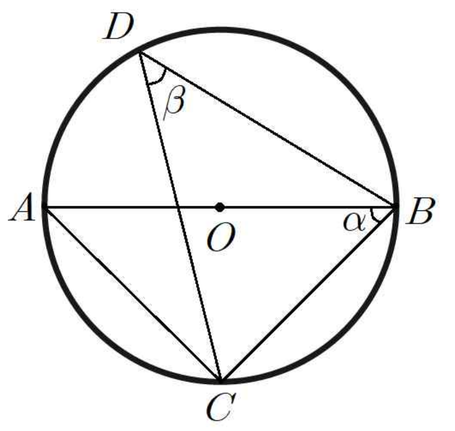

## Q
그림과 같이 선분 $AB$를 지름으로 하는 원 $O$ 위의 두 점 $C$, $D$에 대하여 $\overline{AB}=6$, $\overline{BC}=4$이다. $\angle ABC=\alpha$, $\angle BDC=\beta$라 할 때, $\cos(2\alpha+\beta)\tan(\alpha+2\beta)$의 값은?

## Choices
① $-\dfrac{4\sqrt{5}}{15}$
② $-\dfrac{2}{3}$
③ $\dfrac{2}{3}$
④ $\dfrac{5}{6}$
⑤ $\dfrac{4\sqrt{5}}{15}$

## Answer
④

## Solution
$AB$가 지름이므로 $\triangle ABC$는 $C$에서 직각이다.
따라서
\[
AC=\sqrt{AB^2-BC^2}=\sqrt{36-16}=2\sqrt{5}
\]
이다.

그러므로
\[
\cos\alpha=\frac{BC}{AB}=\frac{2}{3},\qquad
\sin\alpha=\frac{AC}{AB}=\frac{\sqrt{5}}{3}
\]
이다.

또 $\angle BAC$와 $\angle BDC$는 같은 호 $BC$를 보고 있으므로
\[
\beta=\frac{\pi}{2}-\alpha
\]
이다.

따라서
\[
\cos(2\alpha+\beta)=\cos\left(\alpha+\frac{\pi}{2}\right)=-\sin\alpha=-\frac{\sqrt{5}}{3}
\]
이고
\[
\tan(\alpha+2\beta)=\tan(\pi-\alpha)=-\tan\alpha=-\frac{\sqrt{5}}{2}
\]
이다.

그러므로
\[
\cos(2\alpha+\beta)\tan(\alpha+2\beta)=\frac{5}{6}
\]
이다.
