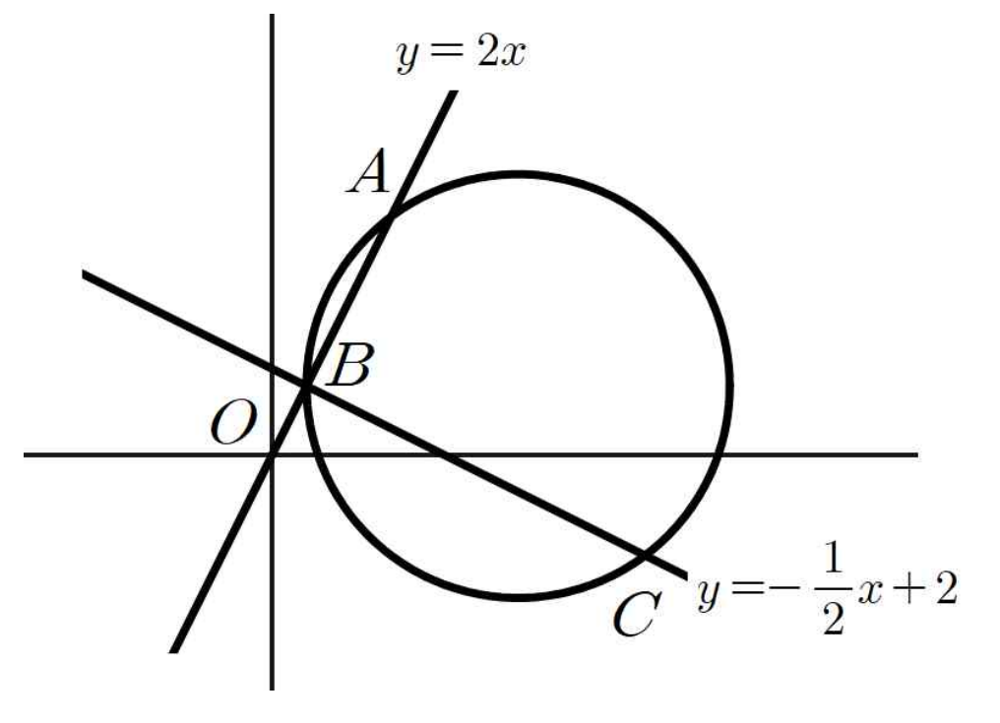

## Q
그림과 같이 중심이 제1사분면 위에 있는 원이 직선 $y=2x$와 두 점 $A$, $B$에서 만나고, 직선 $y=-\frac12x+2$와 두 점 $B$, $C$에서 만난다.

$\overline{AB}=2\sqrt{5}$, $\overline{BC}=4\sqrt{5}$이고, 원의 방정식을 $(x-a)^2+(y-b)^2=r^2$이라 할 때, $5(a-b)+r$의 값을 구하고 풀이 과정을 쓰시오.

## Choices

## Answer
$26$

## Solution
두 직선의 교점이 점 $B$이므로
$$
2x=-\frac12x+2
$$
$$
\frac52x=2
$$
$$
x=\frac45,\qquad y=\frac85
$$
이다.

따라서
$$
B\left(\frac45,\frac85\right)
$$
이다.

직선 $y=2x$의 방향벡터는 $(1,2)$이고 그 길이는 $\sqrt5$이므로, $\overline{AB}=2\sqrt5$에서
$$
A=B+2(1,2)=\left(\frac{14}{5},\frac{28}{5}\right)
$$
이다.

직선 $y=-\frac12x+2$의 방향벡터는 $(2,-1)$이고 그 길이는 $\sqrt5$이므로, $\overline{BC}=4\sqrt5$에서
$$
C=B+4(2,-1)=\left(\frac{44}{5},-\frac{12}{5}\right)
$$
이다.

직선 $AB$의 기울기는 $2$, 직선 $BC$의 기울기는 $-\frac12$이므로 두 직선은 서로 수직이다.

따라서
$$
\angle ABC=90^\circ
$$
이고, 점 $A$, $B$, $C$가 모두 원 위에 있으므로 $AC$는 원의 지름이다.

그러므로 원의 중심은 선분 $AC$의 중점이어서
$$
\left(\frac{\frac{14}{5}+\frac{44}{5}}{2},\frac{\frac{28}{5}+\left(-\frac{12}{5}\right)}{2}\right)=\left(\frac{29}{5},\frac85\right)
$$
이다.

즉
$$
a=\frac{29}{5},\qquad b=\frac85
$$
이다.

또
$$
AC=\sqrt{\left(\frac{44}{5}-\frac{14}{5}\right)^2+\left(-\frac{12}{5}-\frac{28}{5}\right)^2}
$$
$$
=\sqrt{6^2+(-8)^2}=10
$$
이므로 반지름의 길이는
$$
r=5
$$
이다.

따라서
$$
5(a-b)+r=5\left(\frac{29}{5}-\frac85\right)+5=21+5=26
$$
이다.
