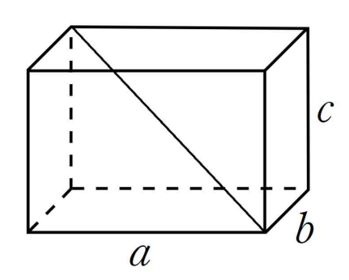

## Q
오른쪽 그림과 같이 세 모서리의 길이가 각각 \(a, b, c\)인 직육면체의 겉넓이가 \(94\)이고, 대각선의 길이가 \(5\sqrt{2}\)일 때, 모든 모서리 길이의 합을 구하시오.

## Choices
① 42  
② 44  
③ 46  
④ 48  
⑤ 50

## Answer
④

## Solution
직육면체의 겉넓이가 \(94\)이므로
\[
2(ab+bc+ca)=94
\]
이고,
\[
ab+bc+ca=47
\]
이다.

또한 대각선의 길이가 \(5\sqrt{2}\)이므로
\[
a^2+b^2+c^2=50
\]
이다.

따라서
\[
(a+b+c)^2
=a^2+b^2+c^2+2(ab+bc+ca)
=50+94
=144
\]
이므로
\[
a+b+c=12
\]
이다.

직육면체의 모든 모서리 길이의 합은
\[
4(a+b+c)=4\times 12=48
\]
이므로 정답은 \(④\)이다.
