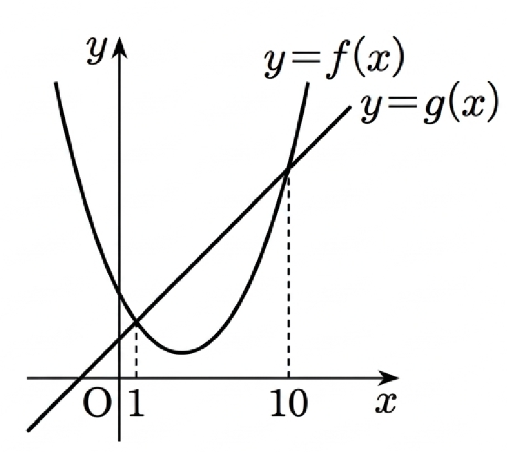

## Q
최고차항의 계수가 \(1\)인 이차함수 \(y=f(x)\)의 그래프와 직선 \(y=g(x)\)가 만나는 두 점의 \(x\)좌표는 \(1, 10\)이다. \(h(x)=g(x)-f(x)\)라 할 때, 함수 \(h(x)\)는 \(x=p\)에서 최댓값 \(q\)를 가진다. 이때, \(p+2q\)의 값을 구하시오.

## Choices
① 30  
② 34  
③ 38  
④ 42  
⑤ 46

## Answer
⑤

## Solution
\[
h(x)=g(x)-f(x)
\]
에서 \(f(x)\)의 최고차항 계수가 \(1\), \(g(x)\)는 일차식이므로
\[
h(x)
\]
는 최고차항 계수가 \(-1\)인 이차함수이다.

또한 \(y=f(x)\)와 \(y=g(x)\)의 교점의 \(x\)좌표가 \(1,10\)이므로
\[
h(1)=0,\quad h(10)=0
\]
이고
\[
h(x)=-(x-1)(x-10)
\]
로 놓을 수 있다.

이때 꼭짓점의 \(x\)좌표는
\[
p=\frac{1+10}{2}=\frac{11}{2}
\]
이고,
\[
q=h\!\left(\frac{11}{2}\right)
=-\left(\frac{11}{2}-1\right)\left(\frac{11}{2}-10\right)
=-\frac{9}{2}\cdot\left(-\frac{9}{2}\right)
=\frac{81}{4}.
\]

따라서
\[
p+2q
=\frac{11}{2}+2\cdot\frac{81}{4}
=\frac{11}{2}+\frac{81}{2}
=46.
\]
정답은 \(⑤\)이다.
