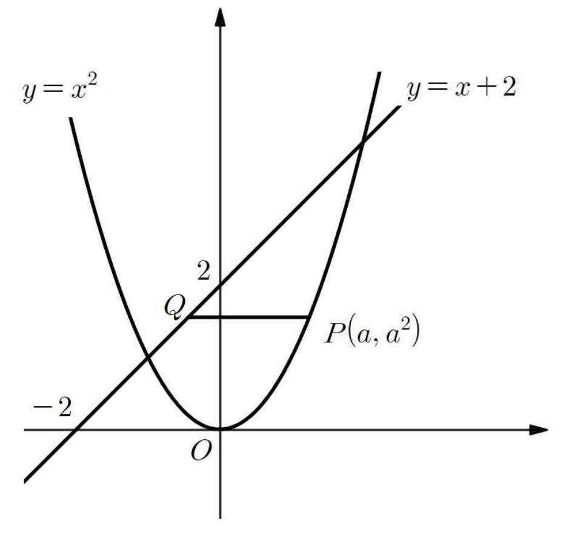

## Q
그림과 같이 함수 $y=x^2$의 그래프 위에 있는 점 $P(a, a^2)$ $(0 < a < 2)$를 지나고 $x$축과 평행한 직선이 직선 $y=x+2$와 만나는 점을 $Q$라 할 때, $\overline{PQ}$의 길이의 최댓값은?

## Choices
① $\frac{5}{4}$
② $\frac{3}{2}$
③ $\frac{7}{4}$
④ $2$
⑤ $\frac{9}{4}$

## Answer
$\frac{9}{4}$

## Solution
1. 점 $P(a, a^2)$를 지나고 $x$축에 평행한 직선의 방정식은 $y = a^2$입니다.
2. 점 $Q$는 직선 $y=a^2$과 $y=x+2$의 교점이므로, $y=a^2$을 $y=x+2$에 대입하면 $a^2 = x+2$에서 $x = a^2-2$를 얻습니다.
   따라서 점 $Q$의 좌표는 $(a^2-2, a^2)$입니다.
3. 선분 $\overline{PQ}$의 길이는 두 점 $P(a, a^2)$와 $Q(a^2-2, a^2)$의 $x$좌표의 차이의 절댓값입니다.
   $PQ = |a - (a^2-2)| = |-a^2 + a + 2|$.
4. 주어진 조건 $0 < a < 2$에서 이차식 $-a^2 + a + 2$의 부호를 확인합니다.
   $-a^2 + a + 2 = -(a^2 - a - 2) = -(a-2)(a+1)$.
   $0 < a < 2$일 때, $a-2 < 0$이고 $a+1 > 0$이므로, $(a-2)(a+1) < 0$입니다.
   따라서 $-(a-2)(a+1) > 0$이므로, $PQ = -a^2 + a + 2$입니다.
5. $PQ$의 최댓값을 구하기 위해 이차함수 $f(a) = -a^2 + a + 2$의 최댓값을 찾습니다.
   이 함수는 위로 볼록한 포물선이며, 꼭짓점의 $a$좌표는 $a = -\frac{1}{2(-1)} = \frac{1}{2}$입니다.
   $a = \frac{1}{2}$은 주어진 범위 $0 < a < 2$ 안에 포함됩니다.
6. $a = \frac{1}{2}$일 때 $PQ$의 길이는 최댓값을 갖습니다.
   최댓값 $PQ = -\left(\frac{1}{2}\right)^2 + \frac{1}{2} + 2 = -\frac{1}{4} + \frac{2}{4} + \frac{8}{4} = \frac{9}{4}$.

따라서 $\overline{PQ}$의 길이의 최댓값은 $\frac{9}{4}$입니다.
