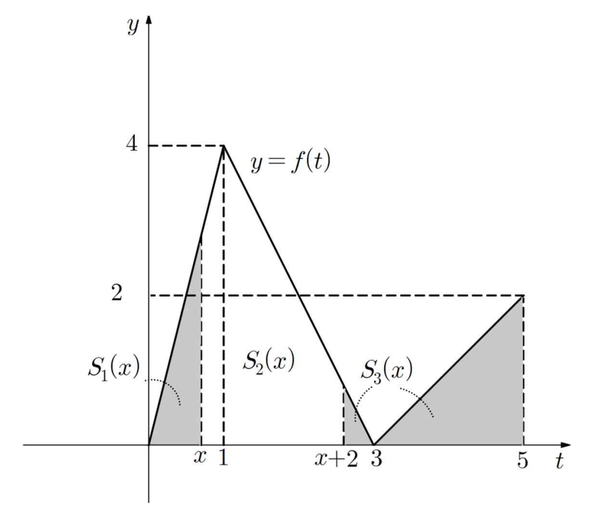

## Q
0 $\le t \le 5$에서 함수 $f(t)$를
$$
f(t)=
\begin{cases}
4t & (0 \le t < 1) \\
-2t+6 & (1 \le t < 3) \\
t-3 & (3 \le t \le 5)
\end{cases}
$$
이라 정의하자.
다음 그림과 같이 $0 < x < 3$에 대하여 함수 $y=f(t)$의 그래프와 $t$축 및 직선 $t=x$로 둘러싸인 부분의 넓이를 $S_1(x)$, 함수 $y=f(t)$의 그래프와 $t$축 및 직선 $t=x, t=x+2$로 둘러싸인 부분의 넓이를 $S_2(x)$, 함수 $y=f(t)$의 그래프와 $t$축 및 직선 $t=x+2, t=5$로 둘러싸인 부분의 넓이를 $S_3(x)$라 하자. $S_1(x), S_2(x), S_3(x)$ 중에서 가장 작은 값을 $g(x)$라 할 때, 방정식 $g(x)-1=0$을 만족시키는 모든 $x$의 값의 곱을 구하시오.

## Choices

## Answer
$1 + \frac{\sqrt{2}}{2}$

## Solution
주어진 함수는 $0 \le t \le 5$에서 항상 $f(t)\ge 0$이므로, 넓이는 정적분으로 계산한다.

먼저
$$
F(x)=\int_0^x f(t)\,dt
$$
를 구하면
$$
F(x)=
\begin{cases}
2x^2 & (0 \le x < 1),\\
-x^2+6x-3 & (1 \le x < 3),\\
\frac12 x^2-3x+\frac{21}{2} & (3 \le x \le 5).
\end{cases}
$$
또한 $F(5)=8$이다.

**(1) $0<x<1$일 때**

$$
S_1(x)=F(x)=2x^2
$$
$$
S_2(x)=F(x+2)-F(x)=(-x^2+2x+5)-2x^2=-3x^2+2x+5
$$
$$
S_3(x)=F(5)-F(x+2)=8-(-x^2+2x+5)=x^2-2x+3
$$

비교하면
$$
S_2-S_1=-5x^2+2x+5>0,\quad S_3-S_1=3-2x-x^2>0 \quad (0<x<1)
$$
이므로 이 구간에서 $g(x)=S_1(x)=2x^2$.

따라서
$$
g(x)=1 \iff 2x^2=1 \iff x=\frac{\sqrt2}{2}.
$$

**(2) $1\le x<3$일 때**

$$
S_1(x)=F(x)=-x^2+6x-3
$$
$$
S_2(x)=F(x+2)-F(x)=\frac32 x^2-7x+\frac{23}{2}
$$
$$
S_3(x)=\int_{x+2}^{5}(t-3)\,dt=-\frac12 x^2+x+\frac32
$$

비교하면
$$
S_1-S_3=\frac{-(x-1)(x-9)}{2}>0,\quad
S_2-S_3=2(x-2)^2+2>0 \quad (1\le x<3)
$$
이므로 이 구간에서 $g(x)=S_3(x)$.

따라서
$$
g(x)=1 \iff -\frac12 x^2+x+\frac32=1
\iff x^2-2x-1=0
\iff x=1\pm\sqrt2.
$$
범위 $1\le x<3$에서 $x=1+\sqrt2$만 가능하다.

결국 해는
$$
x=\frac{\sqrt2}{2},\quad x=1+\sqrt2
$$
이고, 곱은
$$
\frac{\sqrt2}{2}(1+\sqrt2)=1+\frac{\sqrt2}{2}.
$$

따라서 정답은 $1+\frac{\sqrt2}{2}$이다.
