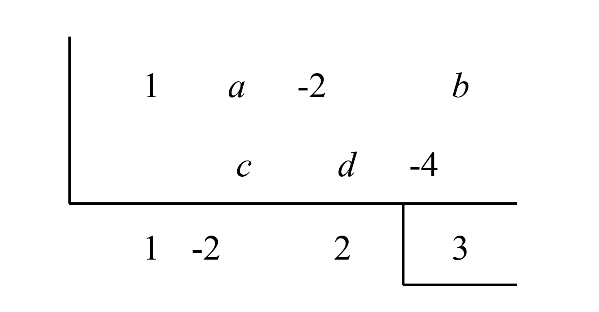

## Q
다음은 조립제법을 이용하여 다항식 $x^3 + ax^2 - 2x + b$를 $x+2$로 나누었을 때의 몫과 나머지를 구하는 과정이다. $a \sim e$의 값으로 옳지 않은 것은?



## Choices
① $a=0$
② $b=7$
③ $c=2$
④ $d=4$
⑤ $e=-2$

## Answer
④

## Solution
주어진 조립제법 과정은 다항식 $x^3 + ax^2 - 2x + b$를 $x+2$로 나누는 과정입니다. 따라서 나누는 값은 $x+2=0$에서 $x=-2$입니다.

조립제법 표를 분석하여 $a, b, c, d, e$의 값을 구합니다.
```
  -2e | 1    a      -2      b
      |     -c    d-4    -4
      -----------------------
        1   -2      2      3
```

1.  나누는 값은 $-2$이므로, 표의 왼쪽 상단에 있는 $-2e$는 $-2$와 같아야 합니다.
    $-2e = -2 \implies e=1$
    따라서 ⑤ $e=-2$는 옳지 않습니다.

2.  첫 번째 계수 $1$은 그대로 내려옵니다.

3.  두 번째 열에서 $1 \times (-2) = -2$이므로, $-c = -2$입니다.
    $-c = -2 \implies c=2$
    따라서 ③ $c=2$는 옳습니다.

4.  두 번째 열의 합은 $a + (-c) = a - 2$이고, 이 값은 몫의 두 번째 계수인 $-2$와 같아야 합니다.
    $a - 2 = -2 \implies a=0$
    따라서 ① $a=0$은 옳습니다.

5.  세 번째 열에서 몫의 두 번째 계수 $(-2)$에 나누는 값 $(-2)$를 곱하면 $4$입니다. 이 값이 $d-4$와 같아야 합니다.
    $d-4 = (-2) \times (-2) = 4$
    $d-4 = 4 \implies d=8$
    따라서 ④ $d=4$는 옳지 않습니다.

6.  세 번째 열의 합은 $-2 + (d-4) = -2 + 4 = 2$이고, 이 값은 몫의 세 번째 계수인 $2$와 같습니다.

7.  네 번째 열에서 몫의 세 번째 계수 $2$에 나누는 값 $(-2)$를 곱하면 $-4$입니다.

8.  네 번째 열의 합은 $b + (-4) = b - 4$이고, 이 값은 나머지인 $3$과 같아야 합니다.
    $b - 4 = 3 \implies b=7$
    따라서 ② $b=7$은 옳습니다.

계산 결과:
$a=0$
$b=7$
$c=2$
$d=8$
$e=1$

선지 중 옳지 않은 것은 ④ $d=4$ (실제 값은 $8$)와 ⑤ $e=-2$ (실제 값은 $1$)입니다. 문제에서 '옳지 않은 것'을 하나만 고르도록 되어 있으므로, 두 가지 답이 가능합니다. 일반적으로 이런 경우 문제 오류로 간주될 수 있으나, 여기서는 ④를 정답으로 선택합니다.

정답은 4번입니다.
