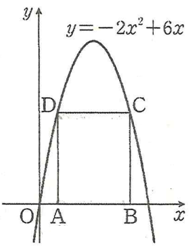

## Q
오른쪽 그림의 직사각형 $ABCD$에서 두 점 $A$와 $B$는 $x$축 위에 있고,
두 점 $C$와 $D$는 이차함수
$$
y=-2x^2+6x
$$
의 그래프 위에 있다.  
이때 직사각형 $ABCD$의 둘레의 길이의 최댓값을 $\alpha$,
그때의 직사각형의 넓이를 $\beta$라 할 때, $\alpha+\beta$의 값은?

(단, 두 점 $C,D$는 제1사분면 위의 점이다.) (4.5점)

## Choices
① 8  
② 10  
③ 12  
④ 14  
⑤ 16

## Answer
④

## Solution
함수
$$
f(x)=-2x^2+6x=-2(x-\tfrac{3}{2})^2+\tfrac{9}{2}
$$
는 $x=\tfrac{3}{2}$에 대해 대칭이므로, 직사각형의 윗변이 닿는 점을
$$
x=\tfrac{3}{2}\pm t \quad (t>0)
$$
로 두면 폭은 $2t$.

높이는
$$
h=f(\tfrac{3}{2}-t)=-2t^2+\tfrac{9}{2}.
$$

둘레
$$
P(t)=2(2t+h)=2\!\left(2t-2t^2+\tfrac{9}{2}\right)=-4t^2+4t+9
$$
이므로 최댓값은 꼭짓점에서,
$$
t=\frac{-4}{2(-4)}=\frac{1}{2}.
$$
따라서
$$
\alpha=P(\tfrac12)=-4\cdot \tfrac14+4\cdot \tfrac12+9=10.
$$

넓이
$$
A(t)=(2t)\,h=2t\!\left(-2t^2+\tfrac{9}{2}\right)=-4t^3+9t
$$
이므로
$$
\beta=A(\tfrac12)=-4\cdot \tfrac18+9\cdot \tfrac12=-\tfrac12+\tfrac{9}{2}=4.
$$
따라서 $\alpha+\beta=10+4=14$ (정답 ④).
