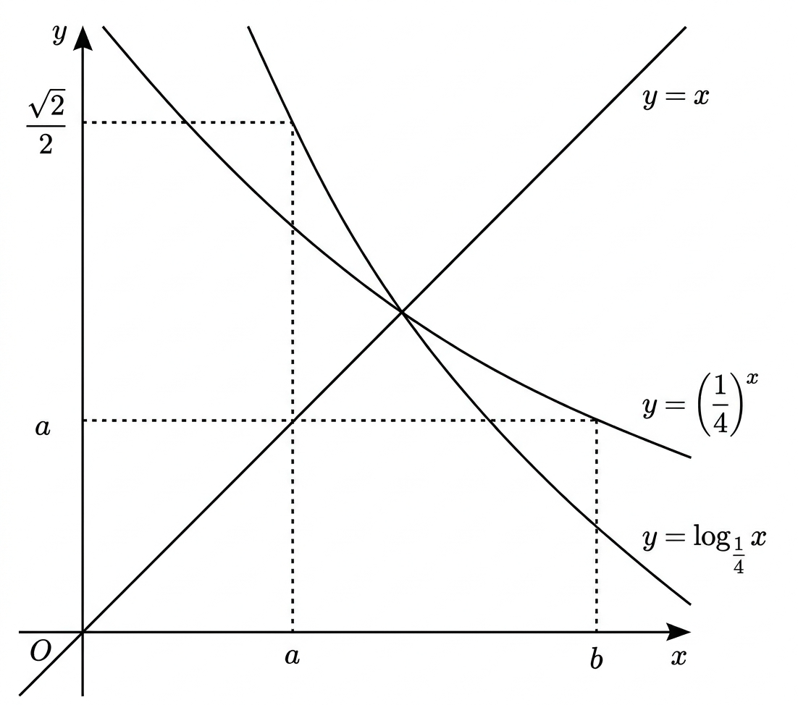

## Q
다음 그림은 함수 $y=\left(\frac{1}{4}\right)^x$, $y=\log_{\frac{1}{4}}x$의 그래프와 직선 $y=x$이다. $\frac{b}{\sqrt{a}}$의 값은?

## Choices
① $\frac{1}{2}$
② $\frac{\sqrt{2}}{2}$
③ $1$
④ $\sqrt{2}$
⑤ $2\sqrt{2}$

## Answer
④

## Solution
주어진 그래프에서 점 $\left(a, \frac{\sqrt{2}}{2}\right)$는 함수 $y=\left(\frac{1}{4}\right)^x$의 그래프 위의 점이므로
$$ \left(\frac{1}{4}\right)^a = \frac{\sqrt{2}}{2} = 2^{-\frac{1}{2}} $$
$\left(2^{-2}\right)^a = 2^{-2a}$이므로 $2^{-2a} = 2^{-\frac{1}{2}}$에서 $a = \frac{1}{4}$이다.

점 $\left(b, a\right)$는 함수 $y=\log_{\frac{1}{4}}x$의 그래프 위의 점이므로
$$ a = \log_{\frac{1}{4}}b $$
$$ b = \left(\frac{1}{4}\right)^a = \left(\frac{1}{4}\right)^{\frac{1}{4}} = 2^{-2 \times \frac{1}{4}} = 2^{-\frac{1}{2}} = \frac{\sqrt{2}}{2} $$

따라서 구하는 값은
$$ \frac{b}{\sqrt{a}} = \frac{\frac{\sqrt{2}}{2}}{\sqrt{\frac{1}{4}}} = \frac{\frac{\sqrt{2}}{2}}{\frac{1}{2}} = \sqrt{2} $$
