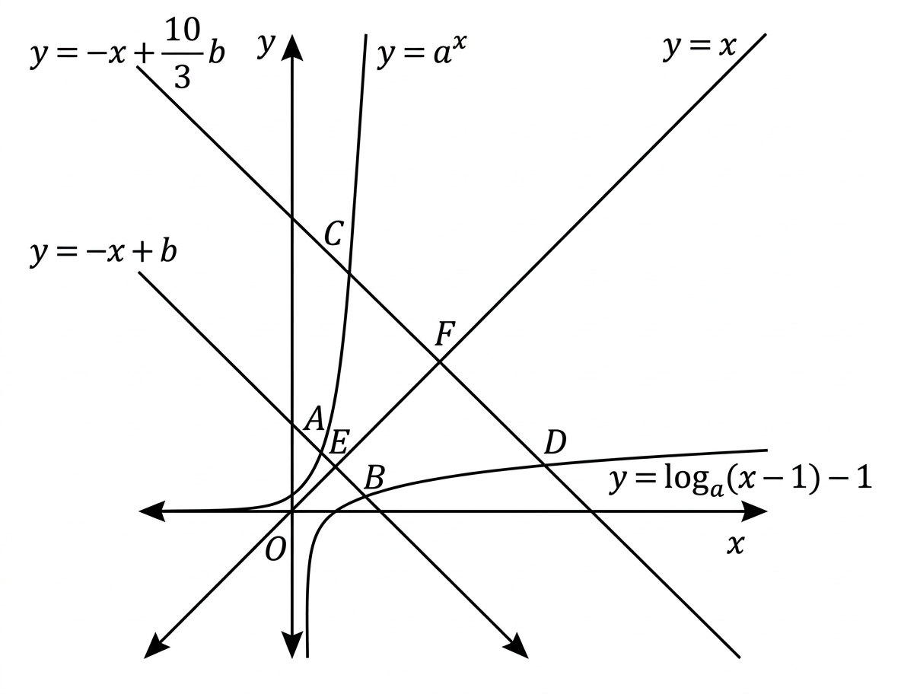

## Q
그림과 같이 $a>1$인 상수 $a$와 $b>a+1$인 상수 $b$에 대하여
직선 $y=-x+b$가 두 곡선 $y=a^x$, $y=\log_a(x-1)-1$와 만나는 점을 각각 $A$, $B$라 하고,
직선 $y=-x+\frac{10}{3}b$가 두 곡선 $y=a^x$, $y=\log_a(x-1)-1$와 만나는 점을 각각 $C$, $D$라 하자.
직선 $y=x$가 두 직선 $y=-x+b$, $y=-x+\frac{10}{3}b$와 만나는 점을 각각 $E$, $F$라 할 때,
$$
\overline{FD}=\sqrt2(b+1),\quad \overline{AE}=\frac{\sqrt2}{6}b
$$
이다. $\overline{EB}\times\overline{CF}$의 값을 구하시오.

## Choices

## Answer
24

## Solution
$E=(\frac b2,\frac b2)$, $F=(\frac{5b}{3},\frac{5b}{3})$.

$\overline{AE}=\frac{\sqrt2}{6}b$에서
$$
\left|x_A-\frac b2\right|=\frac b6
$$
이고, 그림에서 $A$는 왼쪽이므로 $x_A=\frac b3$, $y_A=\frac{2b}{3}$.
따라서
$$
a^{\frac b3}=\frac{2b}{3}\quad\cdots(1)
$$

$\overline{FD}=\sqrt2(b+1)$에서
$$
\left|x_D-\frac{5b}{3}\right|=b+1
$$
이고, 그림에서 $D$는 오른쪽이므로
$$
x_D=\frac{8b}{3}+1,\quad y_D=\frac{2b}{3}-1.
$$
$D$가 로그곡선 위이므로
$$
\log_a\!\left(\frac{8b}{3}\right)=\frac{2b}{3}\quad\cdots(2)
$$

(1)을 제곱하면 $a^{\frac{2b}{3}}=\frac{4b^2}{9}$,
(2)에서 $a^{\frac{2b}{3}}=\frac{8b}{3}$.
따라서
$$
\frac{4b^2}{9}=\frac{8b}{3}\Rightarrow b=6,\quad a=2.
$$

그러면
$$
A=(2,4),\ E=(3,3),\ F=(10,10).
$$
직선 $y=-x+6$과 로그곡선 교점은 $B=(5,1)$,
직선 $y=-x+20$과 지수곡선 교점은 $C=(4,16)$.

$$
\overline{EB}=2\sqrt2,\quad \overline{CF}=6\sqrt2
$$
이므로
$$
\overline{EB}\times\overline{CF}
=(2\sqrt2)(6\sqrt2)=24.
$$
