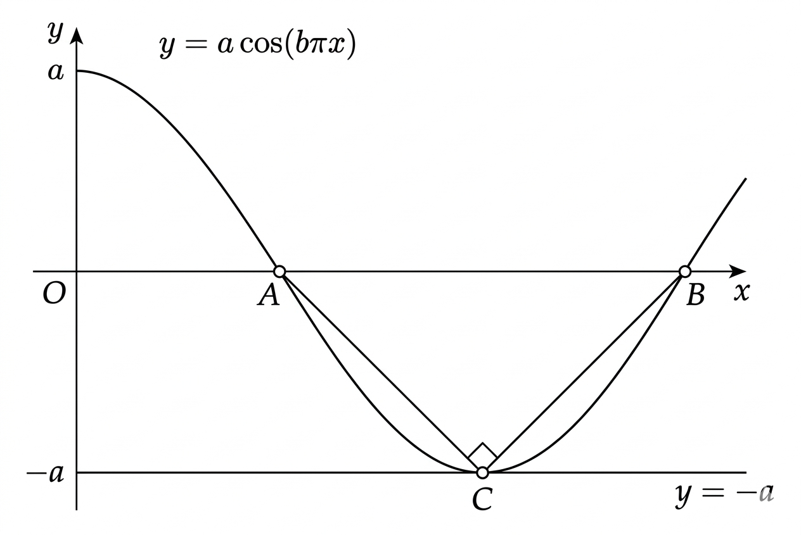

## Q
그림과 같이 두 양수 $a$, $b$에 대하여 함수 $y=a\cos(b\pi x)$의 그래프가 $x$축과 만나는 점을 $A$, $B$라 하고,
함수 $y=a\cos(b\pi x)$의 그래프와 직선 $y=-a$가 만나는 점을 $C$라 할 때,
$\angle ACB=\frac\pi2$이고 삼각형 $ABC$의 넓이는 4이다.
자연수 $n$에 대하여 $0\le x\le\frac{2}{b}$일 때, 방정식
$$
a\cos(bn\pi x)=\frac{2}{n}
$$
의 모든 실근의 합을 $f(n)$이라 하자.
부등식 $20\le f(n)\le 40$을 만족시키는 모든 자연수 $n$의 값의 합을 구하시오.

## Choices

## Answer
12

## Solution
좌표를
$$
A\!\left(\frac{1}{2b},0\right),\ 
B\!\left(\frac{3}{2b},0\right),\ 
C\!\left(\frac1b,-a\right)
$$
로 둔다.

$\angle ACB=\frac\pi2$이므로
$$
\overrightarrow{CA}\cdot\overrightarrow{CB}=0
\Rightarrow a=\frac{1}{2b}\quad\cdots(1)
$$

넓이 조건
$$
\frac12\cdot\overline{AB}\cdot a
=\frac12\cdot\frac1b\cdot a=4
\Rightarrow a=8b\quad\cdots(2)
$$

(1), (2)에서 $b=\frac14$, $a=2$.
따라서
$$
2\cos\left(\frac{n\pi x}{4}\right)=\frac2n
\Rightarrow \cos\left(\frac{n\pi x}{4}\right)=\frac1n.
$$

$t=\frac{n\pi x}{4}$로 두면 $0\le t\le 2n\pi$.
$\alpha=\arccos\frac1n$이라 하면 해는
$$
t=2k\pi+\alpha,\quad t=2k\pi+(2\pi-\alpha)\ (k=0,\dots,n-1)
$$
이고, 같은 $k$의 합은 $4k\pi+2\pi$이다.

따라서 전체 $t$의 합은
$$
\sum_{k=0}^{n-1}(4k\pi+2\pi)=2\pi n^2
$$
이므로
$$
f(n)=\frac{4}{n\pi}\cdot2\pi n^2=8n.
$$

$20\le8n\le40$에서 $n=3,4,5$.
합은 $3+4+5=12$이다.
