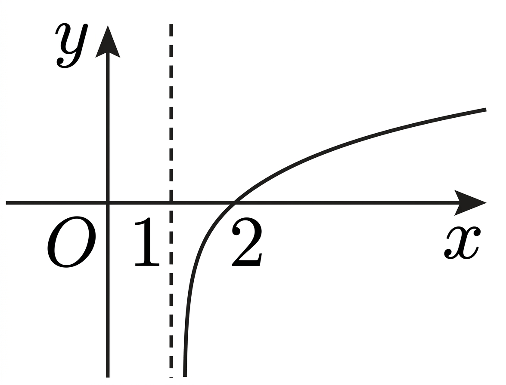

## Q
오른쪽 그래프는 로그함수
\[
y=\log_a(x+b)+c
\]
의 그래프이다. 그래프가 점 \((4,1)\)을 지날 때, \(a+b-c\)의 값은?

## Choices
① $1$
② $2$
③ $3$
④ $4$
⑤ $5$

## Answer
②

## Solution
그래프에서 점근선이 \(x=1\)이므로
\[
x+b=0\Rightarrow -b=1\Rightarrow b=-1
\]
이다.

\((2,0)\)을 지나므로
\[
0=\log_a(2+b)+c=\log_a1+c=c
\Rightarrow c=0
\]
이다.

\((4,1)\)을 지나므로
\[
1=\log_a(4+b)+c=\log_a3
\Rightarrow a=3
\]
이다.

따라서
\[
a+b-c=3+(-1)-0=2
\]
이다.
