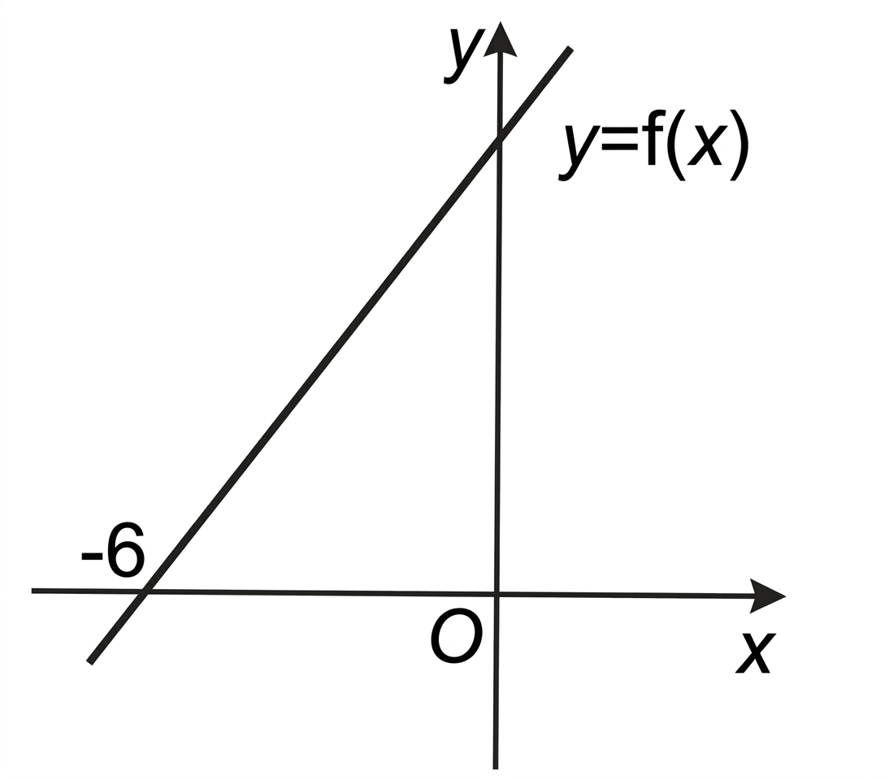

## Q
아래 그래프는 일차함수 \(y=f(x)\)의 그래프이다. 다음 조건을 만족한다.

(1) \(f(-6)=0\)

(2) 부등식 \(3^{f(x)}\le 81\)의 해가 \(x\le -3\)이다.

\(f(1)\)의 값을 구하시오.

## Choices

## Answer
$\dfrac{28}{3}$

## Solution
\[
3^{f(x)}\le81=3^4
\]
이고 \(3^t\)는 증가함수이므로
\[
f(x)\le4
\]
와 같다.

해가 \(x\le-3\)이므로 직선 \(y=f(x)\)에서 \(x=-3\)일 때 \(f(x)=4\)이다.
또 \(f(-6)=0\)이므로 두 점 \((-6,0),(-3,4)\)를 지난다.

기울기는
\[
m=\frac{4-0}{-3-(-6)}=\frac43
\]
이고,
\[
f(1)=0+\frac43\{1-(-6)\}=\frac43\cdot7=\frac{28}{3}
\]
이다.
