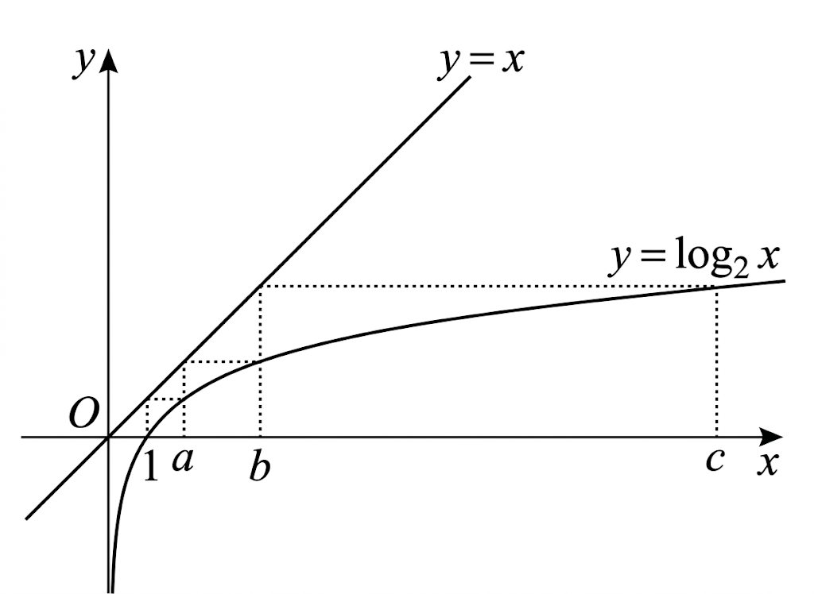

## Q
아래 그래프는 로그함수 \(y=\log_2 x\)의 그래프이다.
상수 \(c\)에 대하여 \(c^8\)은 몇 자리의 정수인지 구하시오.
(단, 점선은 \(x\)축, \(y\)축에 평행하고, \(\log 2=0.301\)로 계산한다.)

## Choices

## Answer
$10$자리

## Solution
그래프의 점선 관계에서
\[
\log_2 a=1,\quad \log_2 b=a,\quad \log_2 c=b
\]
를 읽을 수 있다.

따라서
\[
a=2,\quad b=2^a=4,\quad c=2^b=16
\]
이다.

\[
c^8=16^8=(2^4)^8=2^{32}
\]
이므로
\[
\log(c^8)=\log(2^{32})=32\log2=32\times0.301=9.632
\]
이다.

따라서 \(c^8\)의 자릿수는
\[
\lfloor9.632\rfloor+1=10
\]
자리이다.
