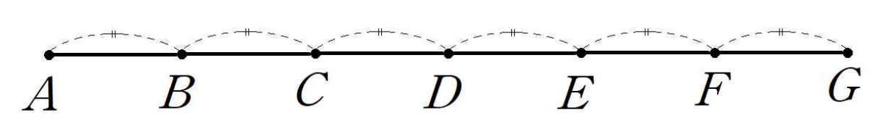

## Q
다음 그림을 보고 다음 중 옳은 것을 고르면?

## Choices
① 점 $C$는 선분 $BF$를 $3:1$로 내분한다.
② 점 $E$는 선분 $BF$를 $1:3$로 내분한다.
③ 점 $F$는 선분 $CE$를 $2:1$로 외분한다.
④ 점 $A$는 선분 $CE$를 $1:2$로 외분한다.
⑤ 점 $C$는 선분 $AG$의 중점이다.

## Answer
④

## Solution
그림에서 인접한 점 사이의 거리가 모두 같으므로
\[
AB=BC=CD=DE=EF=FG
\]
이다.

한 칸의 길이를 $1$이라 하면 점들을 수직선 위의 수로 생각하여
\[
A=0,\ B=1,\ C=2,\ D=3,\ E=4,\ F=5,\ G=6
\]
으로 볼 수 있다.

이때 점 $A$는 선분 $CE$의 바깥쪽에 있고
\[
CA=2,\qquad AE=4
\]
이므로
\[
CA:AE=2:4=1:2
\]
이다.

따라서 점 $A$는 선분 $CE$를
\[
1:2
\]
로 외분한다.

그러므로 정답은 ④이다.
