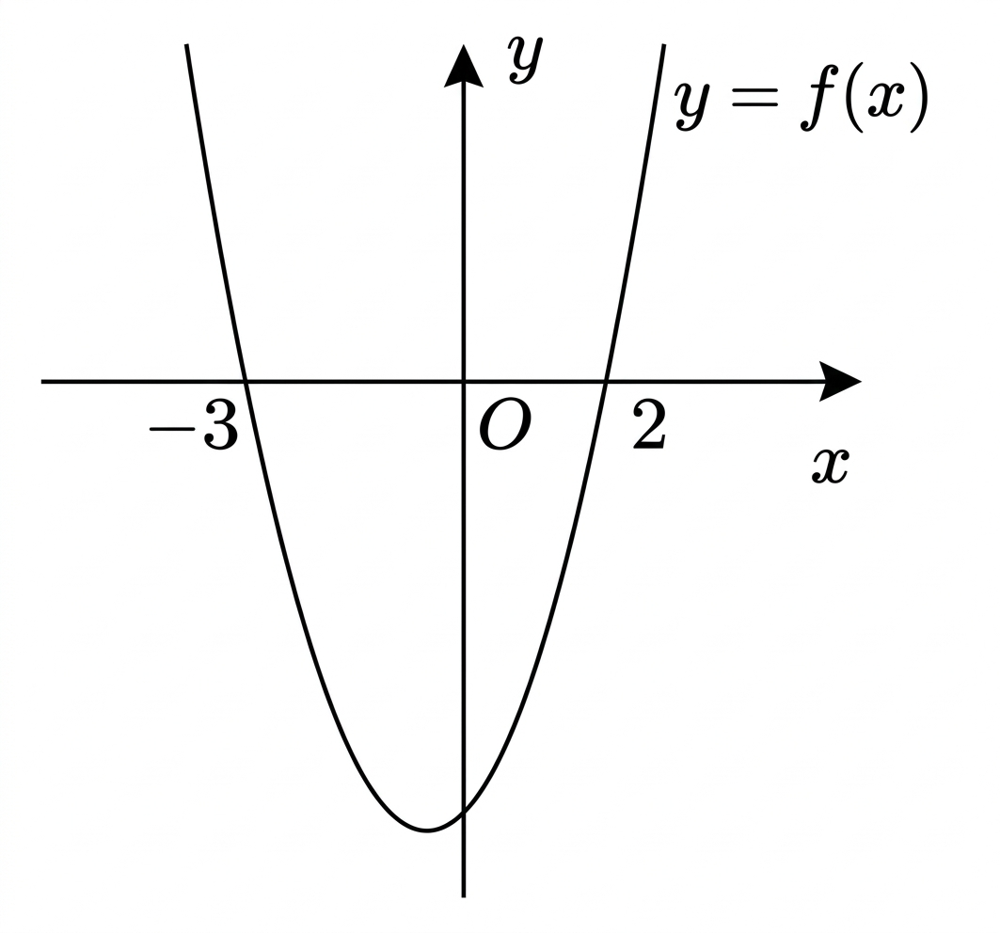

## Q
아래 그림과 같이 이차함수
\[
y=f(x)
\]
에 대하여 이차부등식
\[
f(x)\ge 0
\]
의 해로 옳은 것은?

## Choices
① $x=-3$ 또는 $x=2$
② $-3<x<2$
③ $-3\le x\le 2$
④ $x<-3$ 또는 $x>2$
⑤ $x\le -3$ 또는 $x\ge 2$

## Answer
⑤

## Solution
그래프는 아래로 볼록한 포물선이 아니라 위로 볼록한 포물선이고, $x$축과 만나는 점의 $x$좌표는
\[
-3,\ 2
\]
이다.

따라서 함수값이 $0$ 이상인 부분은 포물선이 $x$축 위에 있거나 $x$축 위의 점인 부분이므로
\[
x\le -3 \quad \text{또는} \quad x\ge 2
\]
이다.

그러므로 정답은 ⑤이다.
