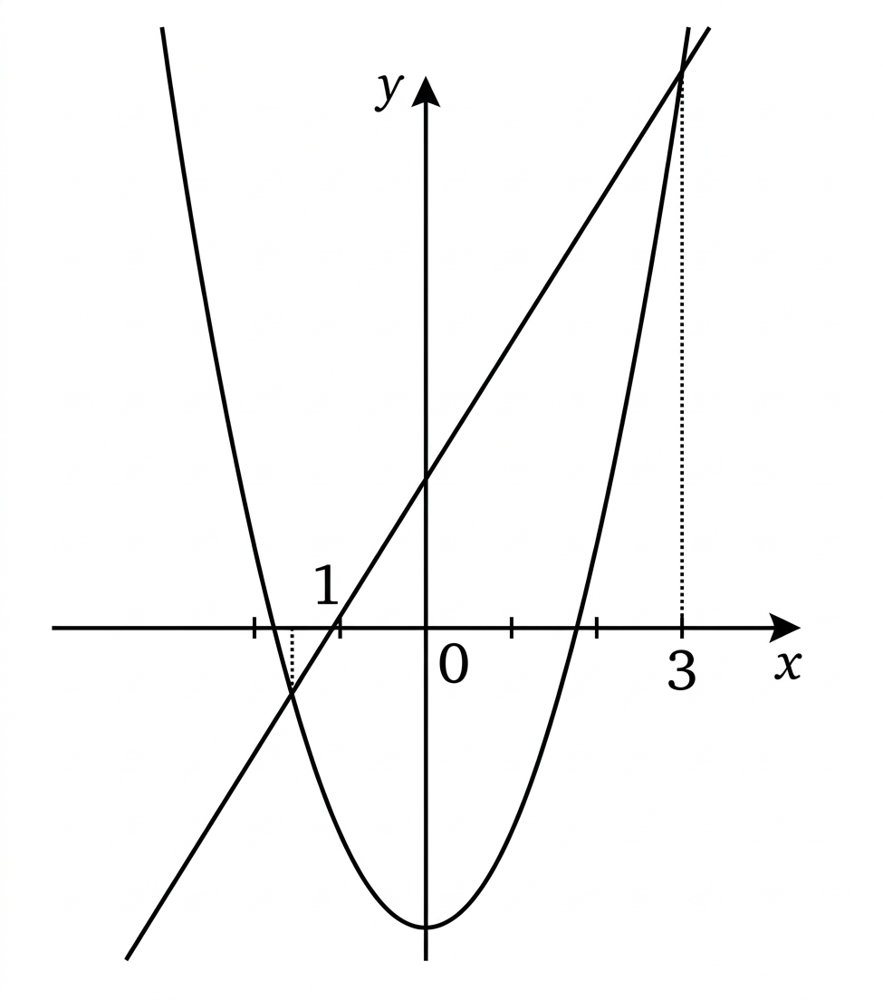

## Q
다음 그림과 같이 이차함수
\[
y=x^2+2n
\]
의 그래프와 직선
\[
y=mx+n
\]
의 교점의 $x$좌표가 각각
\[
-1,\ 3
\]
일 때, 실수 $m$, $n$의 합
\[
m+n
\]
의 값은?

## Choices
① $-2$
② $-1$
③ $0$
④ $1$
⑤ $2$

## Answer
②

## Solution
두 그래프의 교점의 $x$좌표가
\[
-1,\ 3
\]
이므로
\[
x^2+2n=mx+n
\]
에서
\[
x^2-mx+n=0
\]
의 두 근이
\[
-1,\ 3
\]
이다.

근과 계수의 관계에 의하여
\[
(-1)+3=m,\qquad (-1)\cdot 3=n
\]
이므로
\[
m=2,\qquad n=-3
\]
이다.

따라서
\[
m+n=2+(-3)=-1
\]
이므로 정답은 ②이다.
