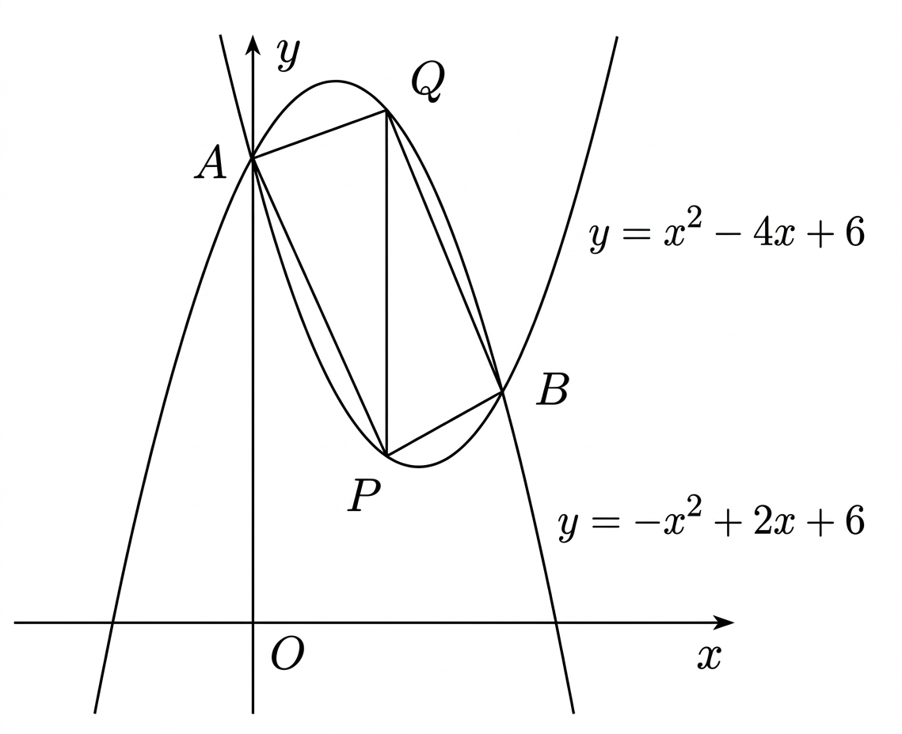

## Q
다음 그림과 같이 두 포물선
\[
y=x^2-4x+6,\qquad y=-x^2+2x+6
\]
이 두 점 $A$, $B$에서 만난다. $y$축에 평행하고 두 점 $A$, $B$ 사이를 지나는 직선을 그어 두 포물선과 만나는 점을 각각 $P$, $Q$라 할 때, 사각형 $APBQ$의 넓이의 최댓값은?

## Choices
① $\frac{25}{4}$
② $\frac{13}{2}$
③ $\frac{27}{4}$
④ $7$
⑤ $\frac{29}{4}$

## Answer
③

## Solution
두 포물선의 교점을 구하면
\[
x^2-4x+6=-x^2+2x+6
\]
\[
2x^2-6x=0
\]
\[
2x(x-3)=0
\]
이므로
\[
A=(0,6),\qquad B=(3,3)
\]
이다.

$y$축에 평행한 직선의 방정식을
\[
x=t\qquad (0\le t\le 3)
\]
라 하자.

그러면
\[
P=(t,\ t^2-4t+6),\qquad Q=(t,\ -t^2+2t+6)
\]
이다.

선분 $PQ$의 길이는
\[
\{-t^2+2t+6\}-(t^2-4t+6)=-2t^2+6t
\]
\[
=2t(3-t)
\]
이다.

사각형 $APBQ$는 선분 $PQ$를 공통 밑변으로 하는 두 삼각형
\[
\triangle APQ,\qquad \triangle BPQ
\]
의 넓이의 합으로 볼 수 있다.

직선 $PQ$는
\[
x=t
\]
이므로, 점 $A(0,6)$에서 직선 $PQ$까지의 거리는
\[
t
\]
이고 점 $B(3,3)$에서 직선 $PQ$까지의 거리는
\[
3-t
\]
이다.

따라서 넓이를 $S$라 하면
\[
S=\frac{1}{2}\cdot PQ\cdot t+\frac{1}{2}\cdot PQ\cdot (3-t)
\]
\[
=\frac{1}{2}\cdot PQ\cdot 3
\]
\[
=\frac{3}{2}\cdot 2t(3-t)
\]
\[
=3t(3-t)
\]
이다.

즉
\[
S=-3t^2+9t
\]
이므로
\[
S=-3\left(t-\frac{3}{2}\right)^2+\frac{27}{4}
\]
이다.

따라서 넓이의 최댓값은
\[
\frac{27}{4}
\]
이므로 정답은 ③이다.
