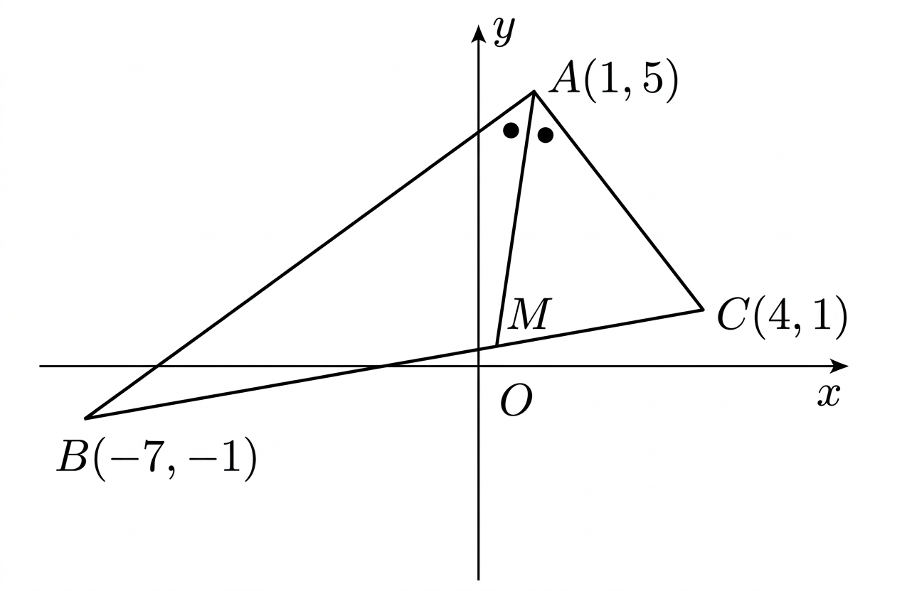

## Q
아래 그림의 삼각형 $ABC$에서 $\angle A$의 이등분선과 선분 $BC$의 교점을 $M$이라 했을 때, 다음 물음에 답하시오.

(1) $\triangle ABM$과 $\triangle ACM$의 넓이비를 구하는 과정을 서술하시오.

(2) 직선 $AM$의 방정식을 구하는 과정을 서술하시오.

## Choices

## Answer
\[
(1)\ 2:1
\]
\[
(2)\ y=7x-2
\]

## Solution
점의 좌표는
\[
A(1,5),\quad B(-7,-1),\quad C(4,1)
\]
이다.

먼저 변의 길이를 구하면
\[
\overline{AB}=\sqrt{(1-(-7))^2+(5-(-1))^2}
=\sqrt{8^2+6^2}=10
\]
\[
\overline{AC}=\sqrt{(4-1)^2+(1-5)^2}
=\sqrt{3^2+(-4)^2}=5
\]
이다.

따라서 각의 이등분선의 성질에 의하여
\[
BM:MC=AB:AC=10:5=2:1
\]
이다.

또 삼각형 $ABM$과 삼각형 $ACM$은 꼭짓점이 $A$이고 밑변이 모두 직선 $BC$ 위에 있으므로 높이가 같다.

따라서 넓이비는
\[
\triangle ABM:\triangle ACM=BM:MC=2:1
\]
이다.

이제 점 $M$은 선분 $BC$를
\[
2:1
\]
로 내분하므로
\[
M\left(\frac{1\cdot(-7)+2\cdot 4}{2+1},\ \frac{1\cdot(-1)+2\cdot 1}{2+1}\right)
\]
\[
=\left(\frac{1}{3},\ \frac{1}{3}\right)
\]
이다.

직선 $AM$의 기울기는
\[
\frac{5-\frac{1}{3}}{1-\frac{1}{3}}
=\frac{\frac{14}{3}}{\frac{2}{3}}
=7
\]
이므로 직선 $AM$의 방정식은
\[
y-5=7(x-1)
\]
\[
y=7x-2
\]
이다.

따라서
\[
(1)\ 2:1,\qquad (2)\ y=7x-2
\]
이다.
