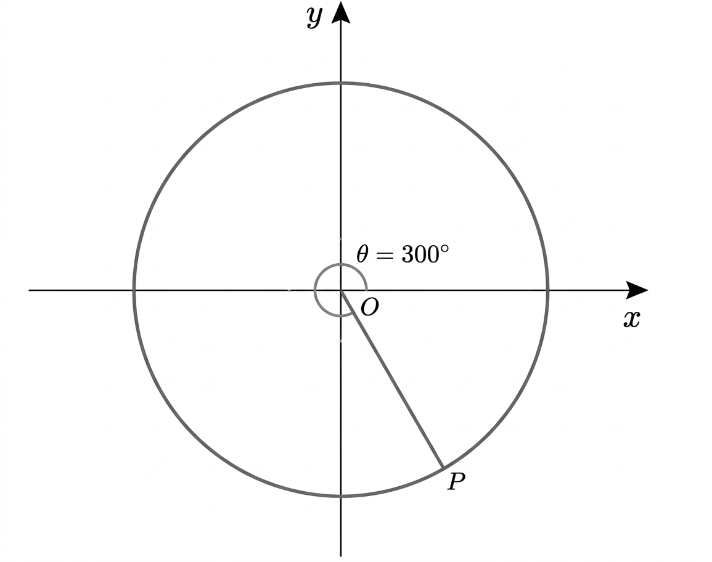

## Q
다음 그림과 같이 동경 $OP$가 나타내는 각의 크기 $\theta$에 대하여 $\sin\theta$ 값을 구하면? (단, $O$는 원점이다.)

## Choices
① $-\dfrac{\sqrt3}{2}$
② $-\dfrac12$
③ $\dfrac12$
④ $\dfrac{\sqrt2}{2}$
⑤ $\dfrac{\sqrt3}{2}$

## Answer
①

## Solution
그림에서 $\theta=300^\circ$이므로
$$\sin\theta=\sin300^\circ=-\frac{\sqrt3}{2}$$
이다. 따라서 ①이다.
