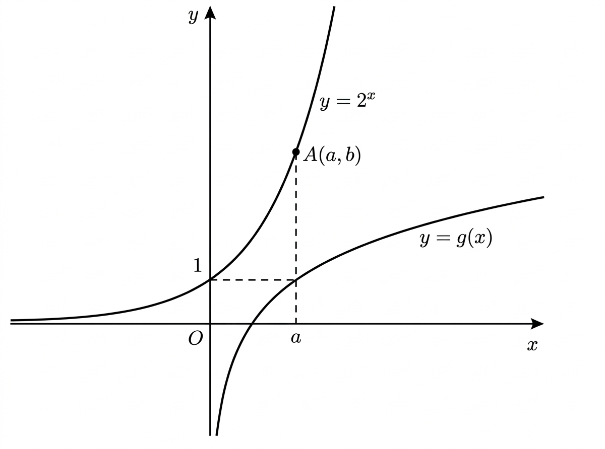

## Q
함수 $y=2^x$과 그 역함수 $y=g(x)$의 그래프가 다음과 같다. 이때, 점 $A$의 좌표를 $(a,b)$라 할 때, $\log_a b$의 값은? (단, 점선은 $x$축 또는 $y$축에 평행하다.)

## Choices
① $\dfrac12$
② $1$
③ $\dfrac32$
④ $2$
⑤ $\dfrac52$

## Answer
④

## Solution
역함수 그래프에서 점선으로 표시된 점이 $(2,1)$이므로 $A$의 $x$좌표는 $a=2$이다.
점 $A$는 $y=2^x$ 위에 있으므로
$$b=2^a=2^2=4$$
이다. 따라서
$$\log_a b=\log_2 4=2$$
이므로 정답은 ④이다.
