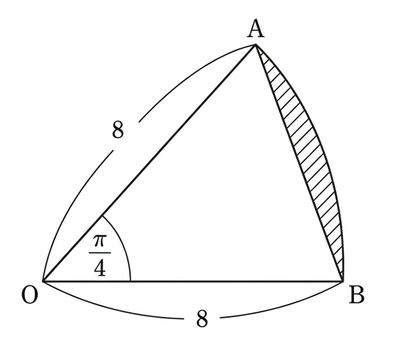

## Q
아래 그림과 같은 중심각의 크기가 $\dfrac{\pi}{4}$이고 반지름이 $8$인 부채꼴에서 빗금 친 부분의 넓이를 구하면?

## Choices
① $8\pi-16\sqrt{2}$  
② $8\pi-15\sqrt{2}$  
③ $8\pi-14\sqrt{2}$  
④ $9\pi-16\sqrt{2}$  
⑤ $9\pi-15\sqrt{2}$

## Answer
①

## Solution
빗금 친 부분은
$$
\text{부채꼴 }OAB\text{의 넓이}-\triangle OAB\text{의 넓이}
$$
이다.

부채꼴의 넓이는
$$
\frac12\cdot 8^2\cdot\frac{\pi}{4}=8\pi
$$
이고,

삼각형 $OAB$의 넓이는
$$
\frac12\cdot 8\cdot 8\cdot \sin\frac{\pi}{4}
=32\cdot\frac{\sqrt2}{2}
=16\sqrt2
$$
이다.

따라서 구하는 넓이는
$$
8\pi-16\sqrt2
$$
이다.
